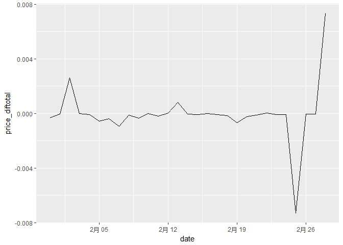
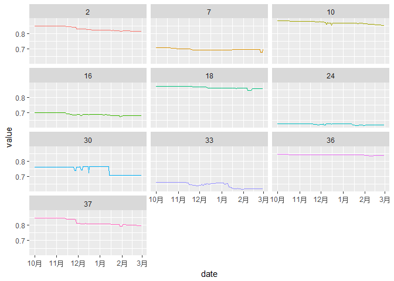

    apply(train, 2, function(x) sum(is.na(x)))

    ##  date   pid  size units 
    ##     0     0     0     0

    apply(items, 2, function(x) sum(is.na(x)))

    ##          pid         size        color        brand          rrp 
    ##            0            0            0            0            0 
    ## mainCategory     category  subCategory        stock  releaseDate 
    ##            0            0         1134            0            0

The items has missing data in subCategory

    table(items$mainCategory)

    ## 
    ##    1    9   15 
    ## 9605 2085 1134

    table(items$category)

    ## 
    ##    2    7   10   16   18   24   30   33   36   37 
    ## 3705 5276  873  491  918  193   11  439  244  674

    table(items$subCategory)

    ## 
    ##    3    4    5    6    8   11   12   13   14   16   17   19   20   21   22 
    ## 2372  326  559  623  725  218   88  460  734  665   96    2  149 1082  514 
    ##   23   25   26   27   28   29   31   32   34   35   38   39   40   41   42 
    ##  178  510   38    9  124   25  252 1164    4  210   46  434   35    7   21 
    ##   43   44 
    ##   14    6

    table(items$category,items$mainCategory) %>% pander

<table style="width:39%;">
<colgroup>
<col width="12%" />
<col width="9%" />
<col width="8%" />
<col width="8%" />
</colgroup>
<thead>
<tr class="header">
<th align="center"> </th>
<th align="center">1</th>
<th align="center">9</th>
<th align="center">15</th>
</tr>
</thead>
<tbody>
<tr class="odd">
<td align="center"><strong>2</strong></td>
<td align="center">3705</td>
<td align="center">0</td>
<td align="center">0</td>
</tr>
<tr class="even">
<td align="center"><strong>7</strong></td>
<td align="center">5276</td>
<td align="center">0</td>
<td align="center">0</td>
</tr>
<tr class="odd">
<td align="center"><strong>10</strong></td>
<td align="center">0</td>
<td align="center">873</td>
<td align="center">0</td>
</tr>
<tr class="even">
<td align="center"><strong>16</strong></td>
<td align="center">0</td>
<td align="center">0</td>
<td align="center">491</td>
</tr>
<tr class="odd">
<td align="center"><strong>18</strong></td>
<td align="center">0</td>
<td align="center">918</td>
<td align="center">0</td>
</tr>
<tr class="even">
<td align="center"><strong>24</strong></td>
<td align="center">0</td>
<td align="center">0</td>
<td align="center">193</td>
</tr>
<tr class="odd">
<td align="center"><strong>30</strong></td>
<td align="center">0</td>
<td align="center">0</td>
<td align="center">11</td>
</tr>
<tr class="even">
<td align="center"><strong>33</strong></td>
<td align="center">0</td>
<td align="center">0</td>
<td align="center">439</td>
</tr>
<tr class="odd">
<td align="center"><strong>36</strong></td>
<td align="center">0</td>
<td align="center">244</td>
<td align="center">0</td>
</tr>
<tr class="even">
<td align="center"><strong>37</strong></td>
<td align="center">624</td>
<td align="center">50</td>
<td align="center">0</td>
</tr>
</tbody>
</table>

    table(items$subCategory,items$mainCategory)

    ##     
    ##         1    9   15
    ##   3  2372    0    0
    ##   4   326    0    0
    ##   5   559    0    0
    ##   6   623    0    0
    ##   8   725    0    0
    ##   11   89  129    0
    ##   12   88    0    0
    ##   13  460    0    0
    ##   14  533  201    0
    ##   16  665    0    0
    ##   17   96    0    0
    ##   19    0    2    0
    ##   20  149    0    0
    ##   21 1082    0    0
    ##   22  385  129    0
    ##   23  173    5    0
    ##   25  347  163    0
    ##   26   38    0    0
    ##   27    9    0    0
    ##   28  124    0    0
    ##   29   10   15    0
    ##   31  252    0    0
    ##   32    0 1164    0
    ##   34    4    0    0
    ##   35    0  210    0
    ##   38    0   46    0
    ##   39  434    0    0
    ##   40   35    0    0
    ##   41    7    0    0
    ##   42    0   21    0
    ##   43   14    0    0
    ##   44    6    0    0

    table(items$subCategory,items$category)

    ##     
    ##         2    7   10   16   18   24   30   33   36   37
    ##   3  2006    0    0    0    0    0    0    0    0  366
    ##   4   326    0    0    0    0    0    0    0    0    0
    ##   5   465    0    0    0    0    0    0    0    0   94
    ##   6   518    0    0    0    0    0    0    0    0  105
    ##   8     0  725    0    0    0    0    0    0    0    0
    ##   11    0   89  129    0    0    0    0    0    0    0
    ##   12    0   88    0    0    0    0    0    0    0    0
    ##   13    0  460    0    0    0    0    0    0    0    0
    ##   14    0  533  201    0    0    0    0    0    0    0
    ##   16    0  665    0    0    0    0    0    0    0    0
    ##   17    0   96    0    0    0    0    0    0    0    0
    ##   19    0    0    0    0    2    0    0    0    0    0
    ##   20    0  149    0    0    0    0    0    0    0    0
    ##   21    0 1082    0    0    0    0    0    0    0    0
    ##   22    0  385  129    0    0    0    0    0    0    0
    ##   23    0  173    5    0    0    0    0    0    0    0
    ##   25    0  347  163    0    0    0    0    0    0    0
    ##   26    0   38    0    0    0    0    0    0    0    0
    ##   27    9    0    0    0    0    0    0    0    0    0
    ##   28    0  124    0    0    0    0    0    0    0    0
    ##   29    0   10   15    0    0    0    0    0    0    0
    ##   31    0  252    0    0    0    0    0    0    0    0
    ##   32    0    0    0    0  874    0    0    0  240   50
    ##   34    0    4    0    0    0    0    0    0    0    0
    ##   35    0    0  210    0    0    0    0    0    0    0
    ##   38    0    0    0    0   42    0    0    0    4    0
    ##   39  375    0    0    0    0    0    0    0    0   59
    ##   40    0   35    0    0    0    0    0    0    0    0
    ##   41    0    7    0    0    0    0    0    0    0    0
    ##   42    0    0   21    0    0    0    0    0    0    0
    ##   43    0   14    0    0    0    0    0    0    0    0
    ##   44    6    0    0    0    0    0    0    0    0    0

    items %>% filter(mainCategory==15) %>% select(subCategory) %>% is.na() %>% sum()

    ## [1] 1134

    table(items$mainCategory,items$brand)

    ##     
    ##      adidas Asics Cinquestelle Converse Diadora Erima FREAM Hummel Jako
    ##   1    3341     0            6        0       4    82     0     88  517
    ##   9     412     8            0      123       9     0     2      0    0
    ##   15    216     0            0        0       0    25     0      7  156
    ##     
    ##      Jordan KangaROOS Kempa Lotto Mizuno New Balance Nike Onitsuka PUMA
    ##   1       0         0     1    10     12          36 4799        0  562
    ##   9     130         3     0     0      0          29 1165        1   47
    ##   15      6         0     0     0      0           0  425        0  163
    ##     
    ##      Reebok Reusch Sells Sport2000 Stance Uhlsport Under Armour
    ##   1       0      6     1         0      0      102           38
    ##   9     104      0     0        44      8        0            0
    ##   15      0      1     0        14      0       24           97

From the tables above, there are 3 main categories and each of them has
its unique categories. All the products whose mainCategory are 15 do not
have subCategory. Besides, in each maincategory, different categories
have different subcategories.

    train$date <- ymd(train$date)
    range(train$date)

    ## [1] "2017-10-01" "2018-01-31"

    range(train$date) %>% diff   

    ## Time difference of 122 days

    unique(train$date) %>% length()

    ## [1] 123

    ## about 85% of the items released before 2017-10-01
    items$releaseDate <- ymd(items$releaseDate)   
    mean(items$releaseDate == ymd("2017-10-01"))

    ## [1] 0.849345

    items_dif<-as.vector(items$releaseDate-min(items$releaseDate))
    hist(items_dif,breaks=25)

    unique(items$pid) %>%length()

    ## [1] 4770

    items %>% group_by(pid) %>%
      summarise(ndate = unique(releaseDate) %>% length) %>%
      select(ndate) %>% table()

    ## .
    ##    1 
    ## 4770

Therefore, we know that each product had only one release date for all
sizes.

    table(items$size) %>% names()

    ##   [1] ""                "0 ( 128 )"       "0 ( 31-33 )"    
    ##   [4] "0 ( Bambini )"   "00 ( 27-30 )"    "01 Junior"      
    ##   [7] "02 Senior"       "1 ( 140 )"       "1 ( 25-30 )"    
    ##  [10] "1 ( 31-34 )"     "1 ( 33-36 )"     "1 ( 34-36 )"    
    ##  [13] "1 ( Junior)"     "10"              "10 (140)"       
    ##  [16] "10 (36-40)"      "10/12 (140-152)" "102 (M)"        
    ##  [19] "104"             "11"              "116"            
    ##  [22] "116-122"         "116/128"         "12 (41-45)"     
    ##  [25] "128"             "134"             "14 (164)"       
    ##  [28] "14 (46-48)"      "14/16 (164-176)" "140"            
    ##  [31] "140/152"         "146"             "152"            
    ##  [34] "158"             "16 (176)"        "164"            
    ##  [37] "164/176"         "176"             "19 (38)"        
    ##  [40] "2"               "2 ( 152 )"       "2 ( 31-34 )"    
    ##  [43] "2 ( 35-38 )"     "2 ( 37-39 )"     "2 ( 37-40 )"    
    ##  [46] "2 ( Senior )"    "24 (M)"          "28 (3XL)"       
    ##  [49] "29"              "2XL"             "2XL/T"          
    ##  [52] "3"               "3 ( 164 )"       "3 ( 39-42 )"    
    ##  [55] "3 ( 40-42 )"     "3 ( 41-43 )"     "3 (35-38 )"     
    ##  [58] "30"              "30 (5XL)"        "31"             
    ##  [61] "31,5"            "32"              "33"             
    ##  [64] "33,5"            "34"              "35"             
    ##  [67] "35 - 38"         "35,5"            "35/38"          
    ##  [70] "36"              "36 2/3"          "36,5"           
    ##  [73] "37"              "37 - 40"         "37 1/3"         
    ##  [76] "37,5"            "38"              "38 2/3"         
    ##  [79] "38,5"            "38/40 ( M / L )" "39"             
    ##  [82] "39-42"           "39 - 42"         "39 1/3"         
    ##  [85] "39,5"            "39/42"           "3XL"            
    ##  [88] "3XL/T"           "4"               "4 ( 39-42 )"    
    ##  [91] "4 ( 43-45 )"     "4 ( 43-46 )"     "4 ( 44-46 )"    
    ##  [94] "40"              "40 2/3"          "40,5"           
    ##  [97] "41"              "41 - 44"         "41 1/3"         
    ## [100] "41,5"            "42"              "42 2/3"         
    ## [103] "42,5"            "43"              "43-46"          
    ## [106] "43 - 46"         "43 1/3"          "43,5"           
    ## [109] "43/46"           "44"              "44 2/3"         
    ## [112] "44,5"            "45"              "45-48"          
    ## [115] "45 - 47"         "45 1/3"          "45,5"           
    ## [118] "46"              "46 2/3"          "46,5"           
    ## [121] "47"              "47 - 50"         "47 1/3"         
    ## [124] "47,5"            "47/49"           "48"             
    ## [127] "48 2/3"          "48,5"            "4XL"            
    ## [130] "5"               "5 ( 43-46 )"     "5 ( 46-48 )"    
    ## [133] "5 ( 47-49 )"     "6"               "6 ( 47-50 )"    
    ## [136] "6/8 (116-128)"   "7"               "7 ( L )"        
    ## [139] "8"               "8 ( XL )"        "9"              
    ## [142] "L"               "L ( 152-158 )"   "L ( 40/42 )"    
    ## [145] "L ( 42-46 )"     "L ( 42-47 )"     "L ( 44 )"       
    ## [148] "L (43 - 46)"     "L/K"             "L/T"            
    ## [151] "L/XL ( 39-47 )"  "M"               "M ( 140-152 )"  
    ## [154] "M ( 38-42 )"     "M ( 38/40 )"     "M ( 40 )"       
    ## [157] "M (38 - 42)"     "M/L"             "S"              
    ## [160] "S ( 128-140 )"   "S ( 34-38 )"     "S ( 34/36 )"    
    ## [163] "S ( 36 )"        "XL"              "XL ( 158-170 )" 
    ## [166] "XL ( 44/46 )"    "XL (46-48,5)"    "XL (46-50 )"    
    ## [169] "XL/T"            "XS"              "XS ( 116-128 )" 
    ## [172] "XS ( 30-34 )"    "XS ( 32 )"       "XS ( 32/34 )"   
    ## [175] "XS/S"            "YLG 147,5-157,5" "YM 135-147,5"   
    ## [178] "YSM 125-135"     "YXL 157,5-167,5"

    table(items$color)

    ## 
    ##   beige    blau   braun    gelb    gold    grau   gruen   khaki    lila 
    ##      77    2418      15     411     107     777     494      29      44 
    ##  orange    pink    rosa     rot schwarz  silber tuerkis   weiss 
    ##     343      68      45    1550    4629      22      20    1775

    table(items$brand)

    ## 
    ##       adidas        Asics Cinquestelle     Converse      Diadora 
    ##         3969            8            6          123           13 
    ##        Erima        FREAM       Hummel         Jako       Jordan 
    ##          107            2           95          673          136 
    ##    KangaROOS        Kempa        Lotto       Mizuno  New Balance 
    ##            3            1           10           12           65 
    ##         Nike     Onitsuka         PUMA       Reebok       Reusch 
    ##         6389            1          772          104            7 
    ##        Sells    Sport2000       Stance     Uhlsport Under Armour 
    ##            1           58            8          126          135

    table(items$rrp)

    ## 
    ##   2.47   5.01   6.28   7.55   8.82  10.09  11.36  12.63   13.9  15.17 
    ##      3      2     31     25     46    222     35    216     23     79 
    ##  15.87  16.44  17.71  18.98  20.25  21.52  22.22  22.79  24.06  25.33 
    ##      3     89      6    263     79     40      1    330      5    565 
    ##  27.87  29.14  30.41  31.68  32.95  34.22  35.49  38.03  40.57  41.84 
    ##     21    179      4    644     23     16    103    781      5     32 
    ##  44.38  46.92  48.19  50.73  53.27  54.54  57.08  60.89  63.43  69.78 
    ##    880      1     40    756      2     14    331      3    481    366 
    ##  76.13  82.48  88.83  95.18 101.53 107.88 114.23 120.58 126.93 133.28 
    ##    283    380    440    381    339     95   1122     65    444      9 
    ## 139.63 145.98 152.33 158.68 163.76 165.03 171.38 177.73 184.08 190.43 
    ##    103     16    208     30      2    209      9    135     19    124 
    ## 196.78 203.13 209.48 215.83 222.18 228.53 234.88 241.23 253.93 266.63 
    ##      2     50      6    153     80     89      6      8    137      7 
    ## 279.33 285.68 292.03 304.73 311.08 317.43 323.78 342.83 349.18 355.53 
    ##    309      1     54     75     13    155      1     10      1     12 
    ## 361.88 368.23 380.93 399.98 406.33 412.68 419.03 444.43 463.48 
    ##      2    155    264     13      2     10     47      3      1

    items%>%filter(size=="") %>% pander

<table style="width:96%;">
<caption>Table continues below</caption>
<colgroup>
<col width="11%" />
<col width="9%" />
<col width="13%" />
<col width="15%" />
<col width="11%" />
<col width="20%" />
<col width="13%" />
</colgroup>
<thead>
<tr class="header">
<th align="center">pid</th>
<th align="center">size</th>
<th align="center">color</th>
<th align="center">brand</th>
<th align="center">rrp</th>
<th align="center">mainCategory</th>
<th align="center">category</th>
</tr>
</thead>
<tbody>
<tr class="odd">
<td align="center">10400</td>
<td align="center"></td>
<td align="center">schwarz</td>
<td align="center">adidas</td>
<td align="center">12.63</td>
<td align="center">1</td>
<td align="center">2</td>
</tr>
<tr class="even">
<td align="center">10609</td>
<td align="center"></td>
<td align="center">schwarz</td>
<td align="center">Uhlsport</td>
<td align="center">5.01</td>
<td align="center">1</td>
<td align="center">2</td>
</tr>
<tr class="odd">
<td align="center">13515</td>
<td align="center"></td>
<td align="center">schwarz</td>
<td align="center">Uhlsport</td>
<td align="center">2.47</td>
<td align="center">1</td>
<td align="center">2</td>
</tr>
<tr class="even">
<td align="center">15996</td>
<td align="center"></td>
<td align="center">schwarz</td>
<td align="center">Uhlsport</td>
<td align="center">6.28</td>
<td align="center">1</td>
<td align="center">2</td>
</tr>
<tr class="odd">
<td align="center">18754</td>
<td align="center"></td>
<td align="center">schwarz</td>
<td align="center">Uhlsport</td>
<td align="center">2.47</td>
<td align="center">1</td>
<td align="center">2</td>
</tr>
<tr class="even">
<td align="center">19517</td>
<td align="center"></td>
<td align="center">silber</td>
<td align="center">adidas</td>
<td align="center">15.17</td>
<td align="center">1</td>
<td align="center">2</td>
</tr>
<tr class="odd">
<td align="center">19891</td>
<td align="center"></td>
<td align="center">schwarz</td>
<td align="center">Uhlsport</td>
<td align="center">2.47</td>
<td align="center">1</td>
<td align="center">2</td>
</tr>
<tr class="even">
<td align="center">20248</td>
<td align="center"></td>
<td align="center">weiss</td>
<td align="center">Uhlsport</td>
<td align="center">5.01</td>
<td align="center">1</td>
<td align="center">2</td>
</tr>
<tr class="odd">
<td align="center">21001</td>
<td align="center"></td>
<td align="center">silber</td>
<td align="center">Uhlsport</td>
<td align="center">8.82</td>
<td align="center">1</td>
<td align="center">2</td>
</tr>
</tbody>
</table>

<table style="width:49%;">
<colgroup>
<col width="19%" />
<col width="11%" />
<col width="18%" />
</colgroup>
<thead>
<tr class="header">
<th align="center">subCategory</th>
<th align="center">stock</th>
<th align="center">releaseDate</th>
</tr>
</thead>
<tbody>
<tr class="odd">
<td align="center">27</td>
<td align="center">1</td>
<td align="center">2017-10-01</td>
</tr>
<tr class="even">
<td align="center">27</td>
<td align="center">8</td>
<td align="center">2017-10-01</td>
</tr>
<tr class="odd">
<td align="center">27</td>
<td align="center">1</td>
<td align="center">2017-10-01</td>
</tr>
<tr class="even">
<td align="center">27</td>
<td align="center">3</td>
<td align="center">2017-10-01</td>
</tr>
<tr class="odd">
<td align="center">27</td>
<td align="center">2</td>
<td align="center">2017-10-01</td>
</tr>
<tr class="even">
<td align="center">27</td>
<td align="center">1</td>
<td align="center">2017-10-01</td>
</tr>
<tr class="odd">
<td align="center">27</td>
<td align="center">3</td>
<td align="center">2017-10-01</td>
</tr>
<tr class="even">
<td align="center">27</td>
<td align="center">8</td>
<td align="center">2017-10-01</td>
</tr>
<tr class="odd">
<td align="center">27</td>
<td align="center">1</td>
<td align="center">2017-10-01</td>
</tr>
</tbody>
</table>

These 9 items do not have a size and they all belong to mainCategory 1,
category 2 and subcategory 27. By checking the table above, we find that
these items are the only items that belong to subCategory 27.

############################# 

Study Price

    prices2<-read.csv(file="D:\\PhD\\Project\\DMC\\prices2.csv",header=T)
    price_dif<-apply(prices2[,-c(1,2,3)],MARGIN = 1,diff)  #difference between two adjacent days
    find_price_dif<-function(x) {
      return(sum(x!=0)!=0)
    }
    price_dif<-t(price_dif)
    sum(apply(price_dif,MARGIN = 1,find_price_dif))  

    ## [1] 1866

We find that there are only 1866 items among 12824 items that had price
change from 2017-10-1 to 2018-1-31.

#### 2018/4/14

    n_brand<-table(items$brand)
    brand_stock<-as.data.frame(t(table(items$brand,items$stock)))
    brand_stock%>%spread(key=Var2,value=Freq) ->brand_stock
    order1<-order(n_brand,decreasing = T)                        #order
    brand_stock<-brand_stock[,c(1,order1+1)]
    row0<-c(0,n_brand[order1])
    brand_stock<-rbind(row0,brand_stock)                       #first line is the total items 

    ## Warning in `[<-.factor`(`*tmp*`, ri, value = 0): invalid factor level, NA
    ## generated

    brand_releaseDate<-table(items$brand,items$releaseDate=="2017-10-1")
    brand_releaseDate<-brand_releaseDate[order1,]

    brand_changePrice<-(table(items$brand,apply(
      price_dif,MARGIN = 1,find_price_dif)))[order1,]
    brand_changePrice<-cbind(brand_changePrice,rate=
                               brand_changePrice[,2]/apply(brand_changePrice,1,sum))

    subCategory_changePrice<-(table(items$subCategory,apply(
      price_dif,MARGIN = 1,find_price_dif)))
    subCategory_changePrice<-cbind(subCategory_changePrice,rate=
                               subCategory_changePrice[,2]/apply(subCategory_changePrice,1,sum))
    subCategory_changePrice<-subCategory_changePrice[order(subCategory_changePrice[,3],decreasing = T),]

    category_changePrice<-table(items$category,apply(
      price_dif,MARGIN = 1,find_price_dif))
    category_changePrice<-cbind(category_changePrice,rate=
                               category_changePrice[,2]/apply(category_changePrice,1,sum))
    category_changePrice<-category_changePrice[order(category_changePrice[,3],decreasing = T),]

    price_dif2<-price_dif/items$rrp
    price_diftotal<-as.vector(apply(price_dif2,MARGIN=2,mean))
    date=ymd(strtrim(seq(ISOdate(2017,10,2), ISOdate(2018,2,28), "DSTday"),10))
    d_pricediftotal<-data.frame(date,price_diftotal)
    ggplot(data=d_pricediftotal,aes(x=date,y=price_diftotal))+geom_line()

 The values in this plot are all
price change average over rrp, and the formula is
$\\frac{1}{N}\\sum^N\_{i=1}\\frac{Price\_{ i}-Price\_{i-1}}{rrp}$. From
this figure above, we can find that the price in Jan and Feb,2018 had
large change and the change was very frequent. Another big change
happend during the Black Friday in Nov 2017.

    ggplot(data=d_pricediftotal[122:150,],aes(x=date,y=price_diftotal))+geom_line()

 Here is the price average change
over rrp plot in Feb 2018. We can see that at the beginning the price
rose a lot and on 25th Feb, the price declined a lot. Probabily the
price were affected by Winter Olymptic Game and another festival called
Fasching on 27th Feb. The Valentine's Day had some impact on the price,
but not very much.

    date2=ymd(strtrim(seq(ISOdate(2017,10,1), ISOdate(2018,2,28), "DSTday"),10))
    prices2<-prices[order(prices$pid),]   #change the pID order to be the same as items 
    prices_average<-data.frame(category=items$category,prices2[,-c(1,2)]/items$rrp)
    prices_totalaverage<-data.frame(date=date2,prices_totalaverage=
                                      as.vector(apply(prices_average[,-1],MARGIN=2,FUN=mean,na.rm=T)))
    ggplot(prices_totalaverage,aes(x=date,y=prices_totalaverage))+geom_line()

 Here is plot shows the average price
over rrp for all items. We can find the downtrend and the price got the
lowest on 25th Feb and then rose up a lot.

    prices_average %>% group_by(category) %>% summarise_all(funs(mean(.,na.rm=T))) %>% as.data.frame() %>% gather(date,value,-category) ->prices_average2
    prices_average2$date<-rep(date2,each1=10)
    ggplot(data=prices_average2,aes(x=date,y=value))+geom_line()+facet_wrap(~category)

 I tried to analyze the price grouped
by category and found that the price changed with regularity per week.
Besides we can also find that different category has different discount.
The category 7, 16, 24, 33 have big discount where 16, 24, 33 belong to
mainCategory 15 and 7 belongs to mainCategory 1. Category 2, 10, 18, 36,
37 have small discount where 10, 18, 36, 37 belong to mainCategory 9
and 37 and 2 belongs to mainCategory 1.

    table(items$category,items$mainCategory) %>% pander

<table style="width:39%;">
<colgroup>
<col width="12%" />
<col width="9%" />
<col width="8%" />
<col width="8%" />
</colgroup>
<thead>
<tr class="header">
<th align="center"> </th>
<th align="center">1</th>
<th align="center">9</th>
<th align="center">15</th>
</tr>
</thead>
<tbody>
<tr class="odd">
<td align="center"><strong>2</strong></td>
<td align="center">3705</td>
<td align="center">0</td>
<td align="center">0</td>
</tr>
<tr class="even">
<td align="center"><strong>7</strong></td>
<td align="center">5276</td>
<td align="center">0</td>
<td align="center">0</td>
</tr>
<tr class="odd">
<td align="center"><strong>10</strong></td>
<td align="center">0</td>
<td align="center">873</td>
<td align="center">0</td>
</tr>
<tr class="even">
<td align="center"><strong>16</strong></td>
<td align="center">0</td>
<td align="center">0</td>
<td align="center">491</td>
</tr>
<tr class="odd">
<td align="center"><strong>18</strong></td>
<td align="center">0</td>
<td align="center">918</td>
<td align="center">0</td>
</tr>
<tr class="even">
<td align="center"><strong>24</strong></td>
<td align="center">0</td>
<td align="center">0</td>
<td align="center">193</td>
</tr>
<tr class="odd">
<td align="center"><strong>30</strong></td>
<td align="center">0</td>
<td align="center">0</td>
<td align="center">11</td>
</tr>
<tr class="even">
<td align="center"><strong>33</strong></td>
<td align="center">0</td>
<td align="center">0</td>
<td align="center">439</td>
</tr>
<tr class="odd">
<td align="center"><strong>36</strong></td>
<td align="center">0</td>
<td align="center">244</td>
<td align="center">0</td>
</tr>
<tr class="even">
<td align="center"><strong>37</strong></td>
<td align="center">624</td>
<td align="center">50</td>
<td align="center">0</td>
</tr>
</tbody>
</table>
