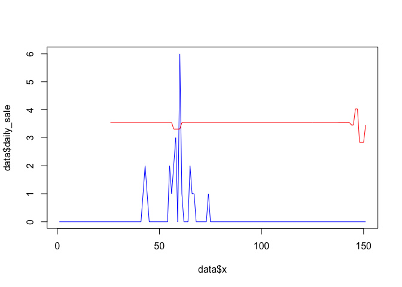

My findings
===========

read data
---------

``` r
library(sugrrants)
library(tidyverse)
library(lubridate)
library(plotly)
setwd("~/Dropbox/DMC")
train <- read.csv("raw_data/train.csv", sep = "|")
prices <- read.csv("raw_data/prices.csv", sep = "|")
items <- read.csv("raw_data/items.csv", sep = "|")
Sale=read.csv("sale.csv")
```

Price Changes
-------------

123 dates in the first 4 months.

``` r
# For the majority of the items, the prices are kept the same over the time. 
#The prices tends to change more in the February (to sold out).
f=function(x) length(unique(x[!is.na(x)]))
# check the price change in from 2017-10-01 to 2018-01-31
table(apply(prices[,3:125],1,f))
```

    ## 
    ##     1     2     3     4     5     6     7     8     9    10    11    12 
    ## 11351   403   351   278   122    96    83    60    13    17    14    25 
    ##    13    14    15    20    21    22    26 
    ##     3     1     1     1     3     1     1

``` r
# check the price change in from 2017-10-01 to 2018-02-28
table(apply(prices[,3:153],1,f))
```

    ## 
    ##     1     2     3     4     5     6     7     8     9    10    11    12 
    ## 10958   156   413   415   277   134   130    88    67    30    33    17 
    ##    13    14    15    16    17    18    19    24    25    26 
    ##    13    19     9    17    18     9    15     1     4     1

``` r
ItemPrice=left_join(items,prices, by = c("pid", "size"))
dateRelease=ymd(ItemPrice$releaseDate)
tt=dateRelease-dateRelease[1]
#released before 2017-10-01 don't have NAs.
sum(is.na(ItemPrice[tt==0,11:133]))
```

    ## [1] 0

``` r
#released after 2017-10-01, the prices will be NA between 2017-10-01 and two days before released day.
## for example, in the record 8, the released day is "2017-10-27", the price between "2017-10-01" to "2017-10-25" will be NA. 
f2=function(x) max(which(is.na(x)))
sum(tt[tt>0]-1!=apply(ItemPrice[tt!=0,11:133], 1, f2))
```

    ## [1] 0

``` r
# The items without changed in price are overlapped with the items released before 2017-10-01.
Index1=which(apply(ItemPrice[,11:133],1,f)!=1)
sum(ymd(ItemPrice[Index1,'releaseDate'])!=dateRelease[1])
```

    ## [1] 1473

``` r
# the prices will be different based on different size
length(unique(prices[,1]))
```

    ## [1] 4770

``` r
f3=function(x) dim(unique(prices[prices[,1]==x,-2]))[1]
AA=sapply(unique(prices[,1]), f3)
AA[AA!=1]
```

    ##   [1] 10  2  2 11  8  7  7  5  2  2  4  2  2  4  3  3  2  2  2  2  2  3  2
    ##  [24]  2  2  4  2  2  2  4  2  2  2  2  4  5  2  2  2  2  4  2  3  3  4  4
    ##  [47]  2  3  5  3  5  2  4  3  2  6  4  5  5  2  2  2  3  2  4  2  3  4  2
    ##  [70]  7  4  3  2  2  4  3  3  5  2  4  3  2  5  2  2  2  3  2  2  2  2  4
    ##  [93]  2  4  5  2 12  9  3  2  3  2  4  3  2  4  9  9  2  2  5  2  2  2  2
    ## [116]  2  4  3  2  5  2  3  2  5  9  2  2  4  4  2  3  3  5  2  2  3  2  4
    ## [139]  4  4  3  3  4  3  5  2  3  2  2  2  4  2  5  2  2  2  3  4  4  2  3
    ## [162]  4  2  2  3  3  2  2  2  2  3  3  2  2  4  3  2  2  3  3  2  3  2  2
    ## [185]  2  3  3  5  2  3  6  2  4  5  4  4  2  5  2  3 10  2  3  2  2  5  3
    ## [208]  2  2  5  2  2  2  4  2  3  2  2  3  2  3  2  2  3  3  7  9  6  8

Daily Price and Daily Sale
--------------------------

123 dates in the first 4 months.

``` r
ItemPrice=left_join(items,prices, by = c("pid", "size"))
PP=ItemPrice[,11:161]/ItemPrice[,5]
PP1=PP[,1:123]
Change=apply(PP1,1,f)
relation=NULL
for (iter in which(Change>1)){
  tt=which(!is.na(PP1[iter,]))
  relation=c(relation,cor(t(PP1[iter,tt]),t(Sale[iter,tt+2])))
}
# density plot of correlation
plot(density(relation),main='Correlation between daily price and daily sale')
```


``` r
# high negative correlated
x=1:151
id=649
daily_sale=t(Sale[id,-(1:2)])
daily_price=t(PP[id,])*max(daily_sale)
data=data.frame(x,daily_sale,daily_price)
colnames(data)=c('x','daily_sale','daily_price')
plot(data$x,data$daily_sale,type='l',col='blue')
points(data$x,data$daily_price,type='l',col='red')
```



``` r
# midden negative correlated
x=1:151
id=887
daily_sale=t(Sale[id,-(1:2)])
daily_price=t(PP[id,])*max(daily_sale)
data=data.frame(x,daily_sale,daily_price)
colnames(data)=c('x','daily_sale','daily_price')
plot(data$x,data$daily_sale,type='l',col='blue')
points(data$x,data$daily_price,type='l',col='red')
```


``` r
# low negative correlated
x=1:151
id=8942
daily_sale=t(Sale[id,-(1:2)])
daily_price=t(PP[id,])*max(daily_sale)
data=data.frame(x,daily_sale,daily_price)
colnames(data)=c('x','daily_sale','daily_price')
plot(data$x,data$daily_sale,type='l',col='blue')
points(data$x,data$daily_price,type='l',col='red')
```


``` r
#p <- plot_ly(data, x=~x, y=~daily_sale,name='Sale',type='scatter',mode='lines+markers') %>%
#  add_trace(y=~daily_price, name='price', mode='lines+markers')
#p 
# positive correlated
x=1:151
id=6696
daily_sale=t(Sale[id,-(1:2)])
daily_price=t(PP[id,])*max(daily_sale)
data=data.frame(x,daily_sale,daily_price)
colnames(data)=c('x','daily_sale','daily_price')
plot(data$x,data$daily_sale,type='l',col='blue')
points(data$x,data$daily_price,type='l',col='red')
```


Stock
-----

``` r
plot(table(items$stock),xlab='frequency')
```


