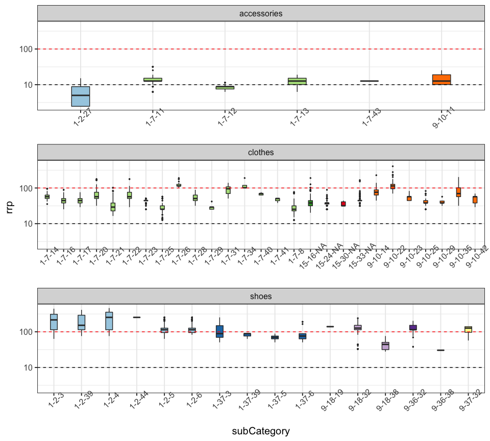
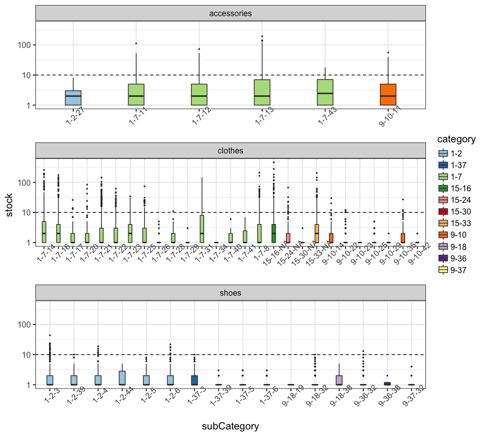
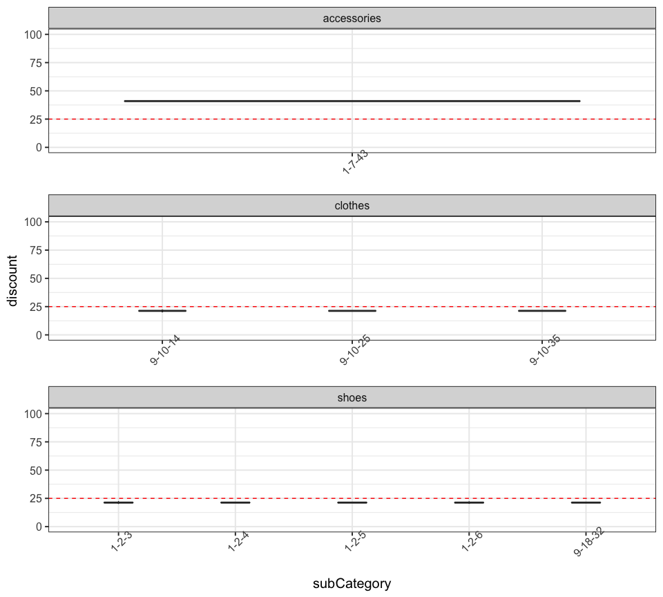

My findings
===========
 
read data
---------

``` r
library(sugrrants)
library(tidyverse)
library(lubridate)
library(forcats)
library(corrplot)
# setwd("~/Dropbox/dmc2018")
train <- read.csv("../../data/raw_data/train.csv", sep = "|", stringsAsFactors = F)
prices <- read.csv("../../data/raw_data/prices.csv", sep = "|", stringsAsFactors = F)
items <- read.csv("../../data/raw_data/items.csv", sep = "|", stringsAsFactors = F)
train$date <- ymd(train$date)
items$releaseDate <- ymd(items$releaseDate)
items <- items %>% 
  mutate(ctgroup = ifelse(subCategory %in% c(11, 12, 13, 27, 43), "accessories",
                          ifelse(category %in% c(2, 37, 18, 36), "shoes", "clothes")),
         category = paste(mainCategory, category, sep = "-"),
         subCategory = paste(category, subCategory, sep = "-")) %>%
  mutate_at(vars(mainCategory:subCategory), funs(factor))
## Q: set of keys the same for the three data sets? Yes
key.items <- paste(items$pid, items$size, sep = " & ") 
key.train <- paste(train$pid, train$size, sep = " & ") %>% unique
key.prices <- paste(prices$pid, prices$size, sep = " & ") %>% unique
identical(sort(key.items), sort(key.train))
```

    ## [1] TRUE

``` r
identical(sort(key.items), sort(key.prices))
```

    ## [1] TRUE

``` r
theme_mine <- function(){
  theme_bw(base_size = 15)  +
    theme(axis.text.x = element_text(angle = 45))
}
```

items
-----

``` r
## Q: any missing in items? Yes, subCategory
apply(items, 2, function(x) sum(is.na(x)))
```

    ##          pid         size        color        brand          rrp 
    ##            0            0            0            0            0 
    ## mainCategory     category  subCategory        stock  releaseDate 
    ##            0            0            0            0            0 
    ##      ctgroup 
    ##            0

``` r
## 4770 different pid
items$pid %>% unique() %>% glimpse
```

    ##  int [1:4770] 10000 10001 10003 10006 10008 10013 10015 10017 10020 10025 ...

``` r
## Q: brand, rrp, category(main/sub), releaseDate, even color is the same for pid? Yes
items %>% select(-size, -stock) %>% unique %>% glimpse
```

    ## Observations: 4,770
    ## Variables: 9
    ## $ pid          <int> 10000, 10001, 10003, 10006, 10008, 10013, 10015, ...
    ## $ color        <chr> "gruen", "schwarz", "weiss", "blau", "blau", "sch...
    ## $ brand        <chr> "Nike", "Jako", "Jako", "Under Armour", "PUMA", "...
    ## $ rrp          <dbl> 25.33, 38.03, 12.63, 57.08, 25.33, 69.78, 25.33, ...
    ## $ mainCategory <fctr> 1, 1, 1, 15, 1, 1, 1, 15, 9, 1, 9, 9, 1, 9, 1, 1...
    ## $ category     <fctr> 1-7, 1-7, 1-7, 15-24, 1-7, 1-7, 1-7, 15-33, 9-10...
    ## $ subCategory  <fctr> 1-7-25, 1-7-16, 1-7-13, 15-24-NA, 1-7-8, 1-7-16,...
    ## $ releaseDate  <date> 2017-10-01, 2017-10-01, 2017-10-01, 2017-10-01, ...
    ## $ ctgroup      <chr> "clothes", "clothes", "accessories", "clothes", "...

``` r
## Q: each pid only has one color in different size? Yes
items %>% group_by(pid) %>% 
  summarise(ncol = length(unique(color))) %>%
  select(ncol) %>% table()
```

    ## .
    ##    1 
    ## 4770

``` r
## Q: How many of the items released before 2017-10-01? about 85%
mean(items$releaseDate == ymd("2017-10-01"))
```

    ## [1] 0.849345

``` r
## Q: category decode
items %>% group_by(subCategory) %>%
  summarise(sizes = paste(unique(size), collapse = ","), 
            rrps = paste(unique(rrp), collapse = ","), 
            brands = paste(unique(brand), collapse = ",")) -> items.subcat
items %>%
  ggplot(aes(x = subCategory, y = rrp, fill = category), color = FALSE) +
  scale_fill_brewer(palette = "Paired") + scale_y_log10() +
  geom_boxplot(outlier.size = .5) + guides(fill = FALSE) +
  geom_hline(yintercept = 100, color = "red", linetype = 2) +
  geom_hline(yintercept = 10, linetype = 2) +
  facet_wrap(~ctgroup, scales = "free_x", nrow = 3) + 
  theme_mine()
```



train
-----

``` r
## Q: any missing in training? No
apply(train, 2, function(x) sum(is.na(x)))
```

    ##  date   pid  size units 
    ##     0     0     0     0

``` r
## Q: sales data available everyday? Yes, from 2017-10-01 to 2018-01-31
range(train$date)
```

    ## [1] "2017-10-01" "2018-01-31"

``` r
all(seq(ymd("2017-10-01"), ymd('2018-01-31'), by = 1) %in% train$date)
```

    ## [1] TRUE

``` r
## Q: any sale before releaseDate? No
train %>% left_join(items, by = c("pid", "size")) %>% 
  mutate(yn.salebeforerelease = date<releaseDate) %>%
  select(yn.salebeforerelease) %>% table
```

    ## .
    ##  FALSE 
    ## 135117

prices
------

``` r
## gather date and price by product ID and size
prices %>% gather(date, price, -pid, -size) %>%
  mutate(date = gsub("X", "", date) %>% ymd()) -> prices_long
prices_long %>% glimpse
```

    ## Observations: 1,936,424
    ## Variables: 4
    ## $ pid   <int> 19671, 19671, 19671, 19671, 19671, 19671, 19671, 19671, ...
    ## $ size  <chr> "39 1/3", "40", "41 1/3", "42", "42 2/3", "43 1/3", "44"...
    ## $ date  <date> 2017-10-01, 2017-10-01, 2017-10-01, 2017-10-01, 2017-10...
    ## $ price <dbl> 133.31, 133.31, 133.31, 133.31, 133.31, 133.31, 133.31, ...

``` r
## Q: same product may have difference prices in sizes? Yes
prices_long %>% filter(pid == 16427, date == ymd("2017-10-01"))
```

    ##      pid   size       date  price
    ## 1  16427 39 1/3 2017-10-01 100.87
    ## 2  16427 40 2/3 2017-10-01  95.73
    ## 3  16427 41 1/3 2017-10-01 102.08
    ## 4  16427     42 2017-10-01  95.11
    ## 5  16427 42 2/3 2017-10-01  94.15
    ## 6  16427 43 1/3 2017-10-01  95.18
    ## 7  16427     44 2017-10-01  95.78
    ## 8  16427 44 2/3 2017-10-01  95.84
    ## 9  16427 45 1/3 2017-10-01  95.14
    ## 10 16427     46 2017-10-01  95.63
    ## 11 16427 47 1/3 2017-10-01  95.61

``` r
## Q: after releasedate, any missing prices? No 
items %>% left_join(prices_long, by = c("pid", "size")) %>% 
  filter(date >= releaseDate) %>% select(price) %>% is.na %>% any
```

    ## [1] FALSE

``` r
## Q: before releasedate, any non-missing prices? Yes 
items %>% left_join(prices_long, by = c("pid", "size")) %>% 
  filter(date < releaseDate) %>% select(price) %>% is.na %>% any
```

    ## [1] TRUE

``` r
## Q: any charateristic for a price before release date? 
## released after 2017-10-01 , one-day earlier pre-sale advertising price 
items %>% left_join(prices_long, by = c("pid", "size")) %>% 
  filter(!is.na(price)) %>% group_by(pid, size) %>%
  summarise(yn.pricebeforerelease = any(date < releaseDate),
            yn.newrelease = any(releaseDate>ymd("2017-10-01"))) %>%
  ungroup %>% select(yn.pricebeforerelease, yn.newrelease) %>% table
```

    ##                      yn.newrelease
    ## yn.pricebeforerelease FALSE  TRUE
    ##                 FALSE 10892     0
    ##                 TRUE      0  1932

``` r
## one-day earlier
items %>% left_join(prices_long, by = c("pid", "size")) %>% 
  filter(date < releaseDate, !is.na(price)) %>% 
  mutate(diff_date = date-releaseDate) %>% 
  select(diff_date) %>% table()
```

    ## .
    ##   -1 
    ## 1932

``` r
## Q: presale price the same as the price on releaseDate?
## No, mostly lower than the actual sale price
items %>% left_join(prices_long, by = c("pid", "size")) %>%
  filter(date<=releaseDate, releaseDate > ymd("2017-10-01"), !is.na(price)) %>%
  group_by(pid, size) %>% arrange(date) %>% 
  summarise(diff = diff(price) %>% round(2)) %>% ungroup %>%
  select(diff) %>% table
```

    ## .
    ## -49.98    -30 -13.49  -5.74     -3   -1.5  -1.25  -0.73  -0.33  -0.23 
    ##      1     10     25     17      5      4      4      1      3      1 
    ##      0   0.07 
    ##   1859      2

calendar
--------

``` r
## remarkably more sales on Black Friday 2017-11-24
daily.sales <- train %>% group_by(date) %>% summarise(n = sum(units)) %>% ungroup 
daily.sales %>%
  frame_calendar(x = 1, y = 1, date = date) %>%
  ggplot(aes(x = .x, y = .y)) + 
  ggtitle("log-scale daily sold units") + 
  theme(legend.position = "bottom") +
  geom_tile(aes(x = .x+(1/13)/2, y = .y+(1/9)/2, fill = log(n)), colour = "grey50") +
  scale_fill_distiller(name = "", palette = "RdYlBu") -> p2.sale
prettify(p2.sale, label = c("label", "text", "text2"))
```


``` r
## use raw releasedate
## more new products released around Black Friday
daily.release <- items %>% group_by(releaseDate) %>% tally() %>% ungroup
## consider release dates other than 2017-10-01
daily.release %>% filter(releaseDate != ymd("2017-10-01")) %>%
  frame_calendar(x = 1, y = 1, date = releaseDate, calendar = "monthly") %>%
  ggplot(aes(x = .x, y = .y)) + 
  ggtitle("log-scale daily released products") +
  theme(legend.position = "bottom") +
  geom_tile(aes(x = .x+(1/13)/2, y = .y+(1/9)/2, fill = log(n)), colour = "grey50") +
  scale_fill_distiller(name = "", palette = "RdYlBu") -> p2.release
prettify(p2.release, label = c("label", "text", "text2"))
```


data join
---------

``` r
## joining the three tables: items, prices, train
## sale unit is zero if not appearing in the train data for a particular day
## discount: how many percent off the rrp
## diffprice: price differences from the day before
## reldiffprice: how many percent off price the day before
prices %>% gather(date, price, -pid, -size) %>%
  mutate(date = gsub("X", "", date) %>% ymd()) -> prices_long
left_join(prices_long, train, by = c("pid", "size", "date")) %>% 
  left_join(items, by = c("pid", "size")) %>%
  filter(date>=releaseDate-1) %>% ## only keep price info since one day before releasedate
  mutate(units = replace(units, is.na(units) & date < ymd("2018-02-01"), 0),
         key = paste(pid, size, sep = " - "),
         discount = (rrp-price)/rrp*100) %>% 
  group_by(pid, size) %>% 
  mutate(diffprice = price - lag(price),
         reldiffprice = diffprice/lag(price)*100) %>%
  ungroup -> alldata
alldata %>% glimpse
```

    ## Observations: 1,834,669
    ## Variables: 18
    ## $ pid          <int> 19671, 19671, 19671, 19671, 19671, 19671, 19671, ...
    ## $ size         <chr> "39 1/3", "40", "41 1/3", "42", "42 2/3", "43 1/3...
    ## $ date         <date> 2017-10-01, 2017-10-01, 2017-10-01, 2017-10-01, ...
    ## $ price        <dbl> 133.31, 133.31, 133.31, 133.31, 133.31, 133.31, 1...
    ## $ units        <dbl> 0, 0, 0, 0, 0, 0, 0, 0, 0, 0, 0, 0, 0, 0, 0, 0, 0...
    ## $ color        <chr> "schwarz", "schwarz", "schwarz", "schwarz", "schw...
    ## $ brand        <chr> "adidas", "adidas", "adidas", "adidas", "adidas",...
    ## $ rrp          <dbl> 190.43, 190.43, 190.43, 190.43, 190.43, 190.43, 1...
    ## $ mainCategory <fctr> 1, 1, 1, 1, 1, 1, 1, 1, 1, 1, 1, 1, 1, 1, 1, 1, ...
    ## $ category     <fctr> 1-2, 1-2, 1-2, 1-2, 1-2, 1-2, 1-2, 1-2, 1-2, 1-2...
    ## $ subCategory  <fctr> 1-2-3, 1-2-3, 1-2-3, 1-2-3, 1-2-3, 1-2-3, 1-2-3,...
    ## $ stock        <int> 1, 1, 3, 1, 5, 1, 1, 6, 5, 3, 3, 1, 1, 1, 1, 1, 2...
    ## $ releaseDate  <date> 2017-10-01, 2017-10-01, 2017-10-01, 2017-10-01, ...
    ## $ ctgroup      <chr> "shoes", "shoes", "shoes", "shoes", "shoes", "sho...
    ## $ key          <chr> "19671 - 39 1/3", "19671 - 40", "19671 - 41 1/3",...
    ## $ discount     <dbl> 29.99527, 29.99527, 29.99527, 29.99527, 29.99527,...
    ## $ diffprice    <dbl> NA, NA, NA, NA, NA, NA, NA, NA, NA, NA, NA, NA, N...
    ## $ reldiffprice <dbl> NA, NA, NA, NA, NA, NA, NA, NA, NA, NA, NA, NA, N...

``` r
## Q: all prices lower than rrp? Yes
summary(alldata$discount)
```

    ##    Min. 1st Qu.  Median    Mean 3rd Qu.    Max. 
    ##    0.00   20.00   25.01   23.63   33.07   80.04

``` r
## Q: any rising prices? Yes
summary(alldata$diffprice)
```

    ##    Min. 1st Qu.  Median    Mean 3rd Qu.    Max.    NA's 
    ## -89.980   0.000   0.000  -0.013   0.000  86.630   12824

brands
------

``` r
## 25 brands
items %>% group_by(brand) %>% 
  summarise(npid = length(unique(pid)), 
            nitem = n(),
            nstock = sum(stock),
            nsize = length(unique(size)),
            ncolor = length(unique(color)),
            nmaincat = length(unique(mainCategory)),
            ncat = length(unique(category)),
            nsubcat = length(unique(subCategory)),
            nnewrelease = length(unique(pid[releaseDate>ymd("2017-10-01")])),
            medrrp = median(rrp[!duplicated(pid)])
  ) -> brands
## label brand by rank of # of stock on Feb 1st
brands <- brands %>% mutate(brand = fct_reorder(brand, nstock, mean),
                            order = as.numeric(brand),
                            no.brand = paste(order, brand, sep = "-")) %>%
  select(brand, no.brand, everything())
brands %>% arrange(desc(npid)) %>% glimpse
```

    ## Observations: 25
    ## Variables: 13
    ## $ brand       <fctr> Nike, adidas, PUMA, Jako, Uhlsport, Erima, Jordan...
    ## $ no.brand    <chr> "25-Nike", "24-adidas", "23-PUMA", "22-Jako", "16-...
    ## $ npid        <int> 2126, 1277, 389, 377, 91, 81, 76, 75, 69, 49, 47, ...
    ## $ nitem       <int> 6389, 3969, 772, 673, 126, 107, 136, 135, 95, 123,...
    ## $ nstock      <int> 25024, 15272, 1735, 1396, 188, 242, 199, 275, 136,...
    ## $ nsize       <int> 53, 61, 42, 50, 17, 32, 16, 21, 18, 25, 16, 19, 19...
    ## $ ncolor      <int> 17, 16, 15, 10, 10, 7, 7, 9, 8, 9, 9, 7, 4, 3, 4, ...
    ## $ nmaincat    <int> 3, 3, 3, 2, 2, 2, 2, 2, 2, 1, 2, 1, 2, 2, 1, 1, 1,...
    ## $ ncat        <int> 11, 10, 9, 4, 5, 4, 4, 6, 2, 4, 4, 3, 6, 3, 2, 1, ...
    ## $ nsubcat     <int> 44, 44, 30, 18, 18, 16, 11, 10, 13, 8, 10, 3, 10, ...
    ## $ nnewrelease <int> 256, 349, 39, 2, 0, 1, 14, 0, 2, 2, 9, 2, 10, 0, 0...
    ## $ medrrp      <dbl> 69.780, 57.080, 44.380, 31.680, 35.490, 35.490, 53...
    ## $ order       <dbl> 25, 24, 23, 22, 16, 19, 17, 20, 14, 15, 13, 18, 21...

``` r
items %>% left_join(brands %>% select(brand, no.brand), by = "brand") -> items.brand
## category by brand
items.brand %>% group_by(no.brand, category, ctgroup) %>% tally %>% ungroup %>%
  mutate(no.brand = fct_reorder(no.brand, n, sum)) %>%
  ggplot(aes(x = no.brand, y = n, fill = category)) +
  geom_bar(stat = "identity", position = "dodge") +
  geom_hline(yintercept = 10, linetype = 2) +
  geom_hline(yintercept = 100, linetype = 2, col = "red") +
  scale_fill_brewer(palette = "Paired") + scale_y_log10() +
  labs(y = "# of items") +
  facet_wrap(~ctgroup, scales = "free_x", nrow = 3) +
  theme_mine()
```


``` r
## stock by brand
## first 12 brands with total stock less than 15
## Reebok only has one piece of clothes in stock, others are all shoes, sold nine times
## Both Selles and Kempa have only one stock, a piece of expensive clothes, sold once
## Onitsuka has only one stock, a pair of shoes, sold once  
items.brand %>% mutate(no.brand = fct_reorder(no.brand, stock, sum)) %>%
  group_by(no.brand, category, ctgroup) %>% mutate(stock = sum(stock)) %>% ungroup %>%
  ggplot(aes(x=no.brand, y=stock, fill = category)) +
  ylab("stock on Feb 1st by brand") +
  scale_fill_brewer(palette = "Paired") + scale_y_log10() + 
  geom_bar(stat = "identity", position = "dodge") +
  geom_hline(yintercept = 10, linetype = 2) +
  geom_hline(yintercept = 1000, linetype = 2, col = "red") +
  facet_wrap(~ctgroup, nrow = 3, scales = "free_x") +
  theme_mine() 
```


``` r
alldata %>% filter(brand %in% c("Sells", "Kempa", "Onitsuka")|pid == 12742, units > 0) %>% glimpse
```

    ## Observations: 4
    ## Variables: 18
    ## $ pid          <int> 16494, 12742, 13619, 21210
    ## $ size         <chr> "L", "S", "XL", "39"
    ## $ date         <date> 2017-11-24, 2017-11-27, 2017-12-27, 2017-12-30
    ## $ price        <dbl> 53.30, 30.42, 152.34, 63.46
    ## $ units        <dbl> 1, 1, 1, 1
    ## $ color        <chr> "schwarz", "schwarz", "schwarz", "tuerkis"
    ## $ brand        <chr> "Kempa", "Reebok", "Sells", "Onitsuka"
    ## $ rrp          <dbl> 76.13, 38.03, 190.43, 101.53
    ## $ mainCategory <fctr> 1, 9, 1, 9
    ## $ category     <fctr> 1-7, 9-10, 1-7, 9-36
    ## $ subCategory  <fctr> 1-7-22, 9-10-25, 1-7-34, 9-36-32
    ## $ stock        <int> 1, 1, 1, 1
    ## $ releaseDate  <date> 2017-10-01, 2017-10-01, 2017-10-01, 2017-10-01
    ## $ ctgroup      <chr> "clothes", "clothes", "clothes", "shoes"
    ## $ key          <chr> "16494 - L", "12742 - S", "13619 - XL", "21210 - 39"
    ## $ discount     <dbl> 29.98818, 20.01052, 20.00210, 37.49631
    ## $ diffprice    <dbl> 0, 0, 0, 0
    ## $ reldiffprice <dbl> 0, 0, 0, 0

``` r
## rrp by brand 
## Q: any brands are low-stock due to high rrp price? Yes
items.brand %>%
  mutate(no.brand = fct_reorder(no.brand, rrp, median)) %>%
  group_by(no.brand, category, ctgroup) %>%
  summarise(rrp = median(rrp)) %>% ungroup %>%
  ggplot(aes(x=no.brand, y=rrp, fill = category)) + 
  geom_bar(stat = "identity", position = "dodge") +
  ylab("median recommended retail price") +
  geom_hline(yintercept = 25, linetype = 2) +
  geom_hline(yintercept = 100, linetype = 2, col = "red") +
  facet_wrap(~ctgroup, nrow = 3, scales = "free_x") +
  scale_fill_brewer(palette = "Paired") +
  guides(color = FALSE) + theme_mine()
```


``` r
## sale volumes by brand during Oct-Jan
## stock strongly positively correlated with sales
alldata %>% group_by(brand, category, ctgroup) %>% 
  summarise(n = sum(units, na.rm = T)) %>% ungroup %>%
  mutate(brand = fct_reorder(brand, n, sum)) %>%
  ggplot(aes(x = brand, y = n, fill = category)) +
  geom_bar(stat = "identity", position = "dodge") + 
  geom_hline(yintercept = 10, linetype = 2) +
  geom_hline(yintercept = 1000, linetype = 2, col = "red") +
  scale_fill_brewer(palette = "Paired") + scale_y_log10() +
  labs(y = "sale volumes during Oct-Jan by brand") +
  facet_wrap(~ctgroup, scales = "free_x", nrow = 3) +
  theme_mine()
```


``` r
alldata %>% group_by(pid, size, brand, ctgroup) %>% 
  summarise(yn.priceincr = any(reldiffprice > 0, na.rm = T),
            yn.newrelease = any(releaseDate > ymd("2017-10-01")),
            yn.pricechange = any(reldiffprice != 0, na.rm = T),
            nsale = sum(units, na.rm = T),
            avg.discount = mean(discount),
            pho = cor(units, discount, use = "complete.obs")) %>%
  ungroup -> check
## Q: changing prices only happen to new released products? Yes
## Q: all new released products have changing prices? No
check %>% select(yn.pricechange, yn.newrelease) %>% table
```

    ##               yn.newrelease
    ## yn.pricechange FALSE  TRUE
    ##          FALSE 10892    66
    ##          TRUE      0  1866

``` r
## Q: all changing prices are at least increased once? No
check %>% select(yn.pricechange, yn.priceincr) %>% table
```

    ##               yn.priceincr
    ## yn.pricechange FALSE  TRUE
    ##          FALSE 10958     0
    ##          TRUE    156  1710

``` r
## distribution by brand
check %>% group_by(brand, ctgroup) %>% 
  summarise(nanyincr = sum(yn.priceincr), 
            nalldecr = sum(yn.pricechange) - sum(yn.priceincr),
            nsame = sum(yn.newrelease) - sum(yn.pricechange)
  ) %>% ungroup() %>%
  left_join(brands %>% select(brand, no.brand), by = "brand") -> brands.check
brands.check %>% select(ctgroup, nanyincr:no.brand) %>%
  mutate(no.brand = fct_reorder(no.brand, nanyincr, sum)) %>%
  gather(group, value, -no.brand, -ctgroup) %>% 
  mutate(group = fct_relevel(group, "nalldecr", "nanyincr", after = Inf)) %>%
  ggplot(aes(x = no.brand, y = value, fill = group)) + scale_y_sqrt() +
  facet_wrap(~ctgroup, scales = "free_x", nrow = 3) +
  geom_bar(stat = "identity", position = "dodge") +
  labs(title = "# of new released products by brand", fill = "") + 
  theme_mine()
```


``` r
## Q: similarities among brands? brand type
train %>% left_join(items %>% select(pid, size, brand), by = c("pid", "size")) %>%
  group_by(brand) %>% summarise(nsale = sum(units)) %>% ungroup %>%
  left_join(brands.check %>% group_by(brand) %>%
              summarise_at(vars(nanyincr:nsame), funs(sum)),
            by = "brand") %>%
  left_join(brands, by = "brand")-> brands.all
brands.all %>% arrange(desc(nstock)) %>% glimpse
```

    ## Observations: 25
    ## Variables: 17
    ## $ brand       <chr> "Nike", "adidas", "PUMA", "Jako", "Sport2000", "Un...
    ## $ nsale       <int> 170695, 109099, 11326, 9512, 5065, 1257, 474, 448,...
    ## $ nanyincr    <int> 578, 1017, 63, 2, 14, 0, 1, 2, 13, 0, 4, 1, 13, 0,...
    ## $ nalldecr    <int> 94, 44, 9, 0, 0, 0, 0, 0, 8, 0, 0, 1, 0, 0, 0, 0, ...
    ## $ nsame       <int> 48, 13, 1, 0, 0, 0, 0, 0, 4, 0, 0, 0, 0, 0, 0, 0, ...
    ## $ no.brand    <chr> "25-Nike", "24-adidas", "23-PUMA", "22-Jako", "21-...
    ## $ npid        <int> 2126, 1277, 389, 377, 26, 75, 81, 32, 76, 91, 49, ...
    ## $ nitem       <int> 6389, 3969, 772, 673, 58, 135, 107, 104, 136, 126,...
    ## $ nstock      <int> 25024, 15272, 1735, 1396, 326, 275, 242, 204, 199,...
    ## $ nsize       <int> 53, 61, 42, 50, 19, 21, 32, 19, 16, 17, 25, 18, 16...
    ## $ ncolor      <int> 17, 16, 15, 10, 4, 9, 7, 7, 7, 10, 9, 8, 9, 3, 4, ...
    ## $ nmaincat    <int> 3, 3, 3, 2, 2, 2, 2, 1, 2, 2, 1, 2, 2, 2, 1, 1, 1,...
    ## $ ncat        <int> 11, 10, 9, 4, 6, 6, 4, 3, 4, 5, 4, 2, 4, 3, 1, 1, ...
    ## $ nsubcat     <int> 44, 44, 30, 18, 10, 10, 16, 3, 11, 18, 8, 13, 10, ...
    ## $ nnewrelease <int> 256, 349, 39, 2, 10, 0, 1, 2, 14, 0, 2, 2, 9, 0, 0...
    ## $ medrrp      <dbl> 69.780, 57.080, 44.380, 31.680, 35.490, 50.730, 35...
    ## $ order       <dbl> 25, 24, 23, 22, 21, 20, 19, 18, 17, 16, 15, 14, 13...

``` r
brands.cols <- brands.all %>% select(-brand, -no.brand, -order)
## standardize variables before computing correlation
brandst <- data.frame(t(scale(brands.cols)))
## not standardized columns
# brandst <- data.frame(t(brands.cols))
colnames(brandst) <- unlist(brands$no.brand)
brands.cor <- cor(brandst)
# corrplot(brands.cor, type = "upper", order = "FPC")
corrplot(brands.cor, type = "full", order = "hclust", addrect = 13)
```


``` r
## competing brands: nike and adidas
items %>% filter(releaseDate > ymd("2017-10-01"), brand %in% c("Nike", "adidas")) %>%
  group_by(releaseDate, brand) %>% tally() %>% ungroup %>% 
  left_join(brands %>% select(brand, no.brand), by = "brand") %>%
  mutate(no.brand = fct_reorder(no.brand, n, sum, .desc = TRUE),
         month = paste(year(releaseDate), month(releaseDate), sep = "-"),
         week = ceiling(day(releaseDate)/7),
         wday = wday(releaseDate)) %>% 
  ggplot(aes(x = releaseDate, y = n, fill= no.brand)) + 
  geom_bar(stat = "identity", position = "dodge") +
  # scale_x_discrete(labels = )
  facet_wrap(~month, scales = "free_x", nrow = 4) +
  labs(y = "# of released products", fill = "") +
  theme_bw(base_size = 15)
```


### best seller

``` r
## Q: which is the bestseller among all (pid, size)?
alldata %>% group_by(pid, size) %>% 
  summarise(nsale = sum(units, na.rm = T)) %>% 
  arrange(desc(nsale)) %>% head(1)
```

    ## # A tibble: 1 x 3
    ## # Groups:   pid [1]
    ##     pid  size nsale
    ##   <int> <chr> <dbl>
    ## 1 12985     L  2979

``` r
## Q: which is the bestseller among which there is no discount all the time?
alldata %>% group_by(pid, size) %>% filter(all(discount == 0)) %>% 
  summarise(nsale = sum(units, na.rm = T)) %>% 
  arrange(desc(nsale)) %>% head(1)
```

    ## # A tibble: 1 x 3
    ## # Groups:   pid [1]
    ##     pid        size nsale
    ##   <int>       <chr> <dbl>
    ## 1 22144 L ( 42-46 )  1044

``` r
## Q: which is the bestseller among which there is an increase in price?
alldata %>% group_by(pid, size) %>% 
  filter(any(reldiffprice > 0)) %>% 
  summarise(nsale = sum(units, na.rm = T)) %>% 
  arrange(desc(nsale)) %>% head(1)
```

    ## # A tibble: 1 x 3
    ## # Groups:   pid [1]
    ##     pid  size nsale
    ##   <int> <chr> <dbl>
    ## 1 20828     L   474

``` r
itemsofinterest <- data.frame(
  label = c("bestseller (12985, L)", "bestseller - rising price (20828, L)", 
            "bestseller - no discount (22144, L)"),
  pid = c(12985, 20828, 22144), size = c("L", "L", "L ( 42-46 )"))
alldata %>% inner_join(itemsofinterest, by = c("pid", "size")) -> plotdata
plotdata %>% filter(!duplicated(cbind(pid, size))) %>% glimpse
```

    ## Observations: 3
    ## Variables: 19
    ## $ pid          <dbl> 22144, 12985, 20828
    ## $ size         <chr> "L ( 42-46 )", "L", "L"
    ## $ date         <date> 2017-10-01, 2017-10-01, 2017-11-15
    ## $ price        <dbl> 10.09, 28.91, 27.97
    ## $ units        <dbl> 4, 26, 0
    ## $ color        <chr> "schwarz", "schwarz", "schwarz"
    ## $ brand        <chr> "Sport2000", "adidas", "adidas"
    ## $ rrp          <dbl> 10.09, 48.19, 50.73
    ## $ mainCategory <fctr> 9, 1, 15
    ## $ category     <fctr> 9-10, 1-7, 15-16
    ## $ subCategory  <fctr> 9-10-11, 1-7-16, 15-16-NA
    ## $ stock        <int> 30, 101, 149
    ## $ releaseDate  <date> 2017-10-01, 2017-10-01, 2017-11-16
    ## $ ctgroup      <chr> "accessories", "clothes", "clothes"
    ## $ key          <chr> "22144 - L ( 42-46 )", "12985 - L", "20828 - L"
    ## $ discount     <dbl> 0.00000, 40.00830, 44.86497
    ## $ diffprice    <dbl> NA, NA, NA
    ## $ reldiffprice <dbl> NA, NA, NA
    ## $ label        <fctr> bestseller - no discount (22144, L), bestseller ...

``` r
## time series plot
## holiday reference: www.timeanddate.com/holidays/germany/2017
plotdata %>% group_by(pid, size) %>% mutate(avg.discount = mean(discount)) %>% ungroup %>%
  ggplot(aes(x = date)) + 
  geom_line(aes(y = units, color = "daily sale (unit)")) +
  geom_line(aes(y = reldiffprice, color = "daily price change (%)")) +
  geom_label(aes(x = max(date), y = max(units, na.rm = T),
                 label = sprintf("subCategory: %s, %s, %.0f%% off", subCategory, ctgroup, avg.discount)),
             hjust = 1, vjust = 1, size = 5, fontface = "bold") +
  geom_vline(aes(color = "NH - German Unity", xintercept = ymd("2017-10-03")), show.legend = T) +
  geom_vline(aes(color = "NH - Reformation Day", xintercept = ymd("2017-10-31")), show.legend = T) +
  geom_vline(aes(color = "NH - Black Friday", xintercept = ymd("2017-11-24")), show.legend = T) +
  scale_x_date(limits = c(ymd("2017-10-01"), ymd("2018-02-28"))) + 
  labs(x = "date", y = "", color = "") +
  theme_bw(base_size = 15) + theme(legend.position = "bottom") +
  facet_wrap(~label, nrow = 3)
```


### stock on Feb 1st

``` r
## 60% of the products only had one stock on Feb 1st
mean(items$stock==1)
```

    ## [1] 0.5938865

``` r
items %>%
  ggplot(aes(x = subCategory, y = stock, fill = category)) + 
  geom_boxplot(outlier.size = 0.5) +
  geom_hline(yintercept = 10, linetype = 2) +
  scale_fill_brewer(palette = "Paired") +
  facet_wrap(~ctgroup, nrow = 3, scales = "free_x") +
  scale_y_log10() + theme_mine()
```



``` r
items %>% mutate(yn.onestock = (stock==1)) %>%
  left_join(check, by = c("pid", "size", "ctgroup", "brand")) %>% 
  select(yn.onestock, yn.pricechange) %>% table()
```

    ##            yn.pricechange
    ## yn.onestock FALSE TRUE
    ##       FALSE  4316  892
    ##       TRUE   6642  974

### sale volumes

``` r
alldata %>% group_by(pid, size, subCategory) %>%
  mutate(nsale = sum(units, na.rm = T)) %>% ungroup %>%
  ggplot(aes(x = subCategory, y = nsale, fill = category)) + 
  ylab("sale volumes during Oct-Jan by category") +
  geom_boxplot(outlier.size = .5) + guides(color = FALSE) +
  facet_wrap(~ctgroup, nrow = 3, scales = "free_x") +
  geom_hline(yintercept = 10, linetype = 2) + 
  scale_fill_brewer(palette = "Paired") + scale_y_log10() +
  theme_mine()
```


### discount

``` r
## products with changing prices
## 1-7 tops and bottoms 
## 9-18 and 9-36 are sports shoes
alldata %>% inner_join(check, by = c("pid", "size", "brand", "ctgroup")) %>%
  # mutate(category = paste(mainCategory, category, sep = "-")) %>%
  filter(yn.pricechange) %>% group_by(date, category, ctgroup) %>%
  summarise(discount = median(discount)) %>% ungroup %>%
  ggplot(aes(x = date, y = discount, color = factor(category))) + 
  ggtitle("median discount by category and date") + 
  geom_line(size = rel(1)) + 
  geom_hline(yintercept = 25, linetype = 2) +
  facet_grid(ctgroup~.) +
  scale_y_continuous(limits = c(0, 75)) +
  scale_color_brewer(palette = "Paired") + theme_bw(base_size = 15) +
  geom_vline(xintercept = ymd("2017-10-31"), linetype = 2, size = rel(0.8)) +
  geom_vline(xintercept = ymd("2017-11-24"), linetype = 2, size = rel(0.8)) +
  geom_vline(xintercept = ymd("2018-02-14"), linetype = 2, size = rel(0.8))
```


``` r
## correlation between sale-volume and discount
tb <- items %>% left_join(check, by = c("pid", "size", "brand", "ctgroup"))
tb %>% arrange(desc(abs(pho))) %>% glimpse
```

    ## Observations: 12,824
    ## Variables: 17
    ## $ pid            <int> 14773, 12111, 12111, 18426, 18499, 15878, 10730...
    ## $ size           <chr> "M", "L", "S", "L", "S", "XL ( 158-170 )", "M",...
    ## $ color          <chr> "schwarz", "blau", "blau", "gruen", "rot", "sch...
    ## $ brand          <chr> "Nike", "adidas", "adidas", "Nike", "Nike", "Ni...
    ## $ rrp            <dbl> 69.78, 50.73, 50.73, 50.73, 50.73, 17.71, 50.73...
    ## $ mainCategory   <fctr> 9, 1, 1, 1, 1, 1, 1, 15, 1, 1, 1, 15, 1, 15, 1...
    ## $ category       <fctr> 9-10, 1-7, 1-7, 1-7, 1-7, 1-7, 1-7, 15-24, 1-7...
    ## $ subCategory    <fctr> 9-10-35, 1-7-23, 1-7-23, 1-7-20, 1-7-20, 1-7-2...
    ## $ stock          <int> 1, 1, 1, 1, 1, 3, 6, 3, 2, 1, 6, 14, 14, 29, 1,...
    ## $ releaseDate    <date> 2018-01-22, 2017-10-23, 2017-10-23, 2017-11-20...
    ## $ ctgroup        <chr> "clothes", "clothes", "clothes", "clothes", "cl...
    ## $ yn.priceincr   <lgl> FALSE, TRUE, TRUE, TRUE, TRUE, TRUE, TRUE, TRUE...
    ## $ yn.newrelease  <lgl> TRUE, TRUE, TRUE, TRUE, TRUE, TRUE, TRUE, TRUE,...
    ## $ yn.pricechange <lgl> TRUE, TRUE, TRUE, TRUE, TRUE, TRUE, TRUE, TRUE,...
    ## $ nsale          <dbl> 1, 3, 4, 2, 2, 7, 24, 3, 5, 10, 2, 11, 5, 72, 1...
    ## $ avg.discount   <dbl> 24.80543, 40.77727, 40.45247, 41.78407, 41.7840...
    ## $ pho            <dbl> 0.9786389, -0.9557390, -0.9557390, 0.8099404, 0...

``` r
## pho only available for items with changing prices before Feb 1st
tb %>% filter(!is.na(pho)) %>% 
  ggplot(aes(x = subCategory, y = pho)) +
  geom_hline(yintercept = 0, color = "red", linetype = 2) +
  geom_boxplot(aes(fill = category), outlier.size = .5) +
  scale_fill_brewer(palette = "Paired") +
  facet_wrap(~ctgroup, nrow = 3, scales = "free_x") +
  labs(title = "correlation between sale-volume and discount by item") +
  theme_mine()
```


``` r
## old products, constant prices
## 1-2-27, nitem = 9, no size, no-discount, cheap, shoelaces?
## 9-36-38, nitem = 4, npid = 2, Nike, women-shoes?
alldata %>% inner_join(check, by = c("pid", "size", "brand", "ctgroup")) %>%
  filter(!yn.newrelease, !duplicated(cbind(pid, size))) %>% 
  ggplot(aes(x = subCategory, y = discount, fill = category), color = FALSE) +
  scale_fill_brewer(palette = "Paired") +
  geom_boxplot(outlier.size = 0.5) + guides(fill = FALSE) +
  facet_wrap(~ctgroup, scales = "free_x", nrow = 3) +
  scale_y_continuous(limits = c(0, 100)) +
  geom_hline(yintercept = 25, color = "red", linetype = 2) +
  theme_mine()
```


``` r
## new released products, constant prices
## 1-7-43 all released after 2017-10-01, nitem = 3 constant prices
alldata %>% inner_join(check, by = c("pid", "size", "brand", "ctgroup")) %>%
  filter(yn.newrelease, !yn.pricechange, !duplicated(cbind(pid, size))) %>% 
  ggplot(aes(x = subCategory, y = discount, fill = category), color = FALSE) +
  scale_fill_brewer(palette = "Paired") +
  scale_y_continuous(limits = c(0, 100)) +
  geom_boxplot(outlier.size = 0.5) + guides(fill = FALSE) +
  geom_hline(yintercept = 25, color = "red", linetype = 2) +
  facet_wrap(~ctgroup, scales = "free_x", nrow = 3) +
  theme_mine()
```


