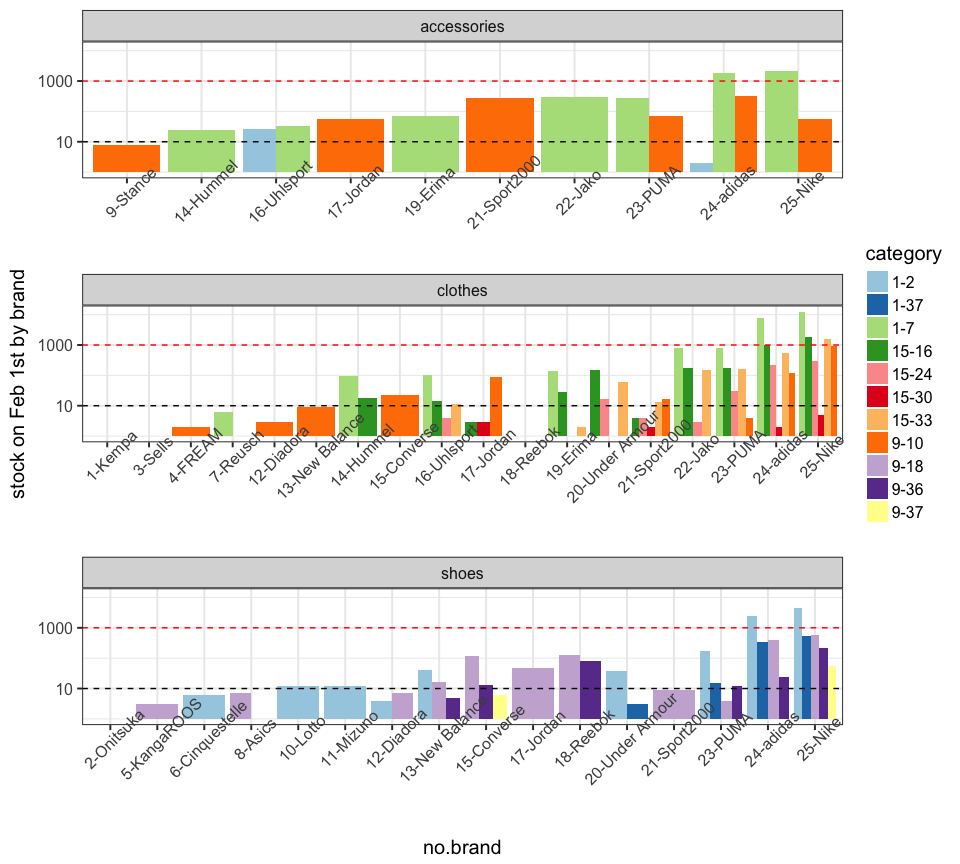
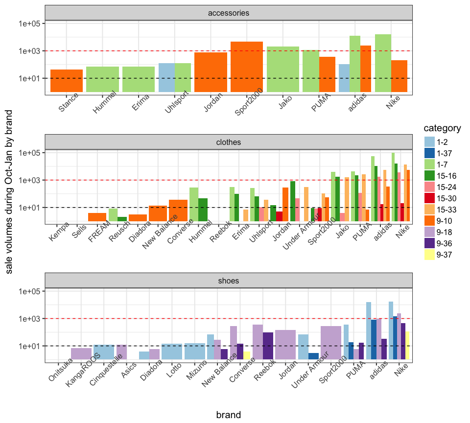
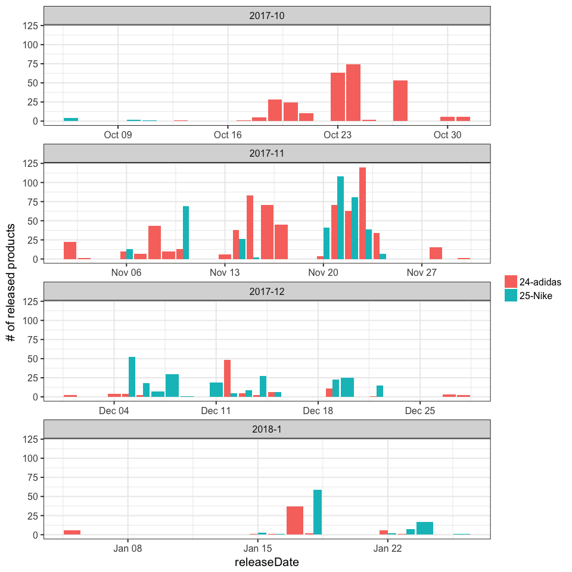
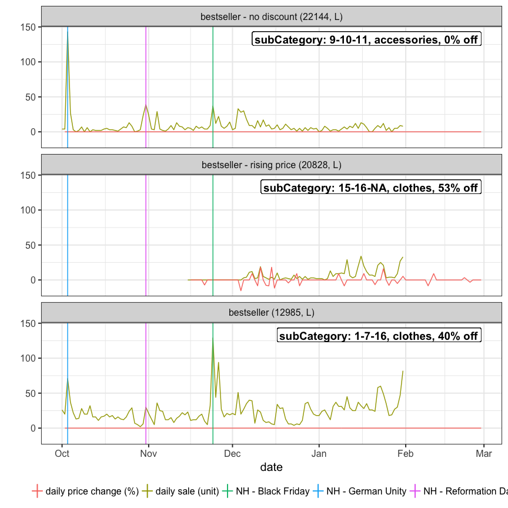

My findings
===========

read data
---------

``` r
library(sugrrants)
library(tidyverse)
library(lubridate)
library(forcats)
library(corrplot)
# setwd("~/Dropbox/dmc2018")
train <- read.csv("../../data/raw_data/train.csv", sep = "|", stringsAsFactors = F)
prices <- read.csv("../../data/raw_data/prices.csv", sep = "|", stringsAsFactors = F)
items <- read.csv("../../data/raw_data/items.csv", sep = "|", stringsAsFactors = F)
items <- items %>% mutate_at(vars(mainCategory:subCategory), funs(factor))
## Q: set of keys the same for the three data sets? Yes
key.items <- paste(items$pid, items$size, sep = " & ") 
key.train <- paste(train$pid, train$size, sep = " & ") %>% unique
key.prices <- paste(prices$pid, prices$size, sep = " & ") %>% unique
identical(sort(key.items), sort(key.train))
```

    ## [1] TRUE

``` r
identical(sort(key.items), sort(key.prices))
```

    ## [1] TRUE

items
-----

``` r
## Q: any missing in items? Yes, subCategory
apply(items, 2, function(x) sum(is.na(x)))
```

    ##          pid         size        color        brand          rrp 
    ##            0            0            0            0            0 
    ## mainCategory     category  subCategory        stock  releaseDate 
    ##            0            0         1134            0            0

``` r
## 4770 different pid
items$pid %>% unique() %>% glimpse
```

    ##  int [1:4770] 10000 10001 10003 10006 10008 10013 10015 10017 10020 10025 ...

``` r
## Q: brand, rrp, category(main/sub), releaseDate, even color is the same for pid? Yes
items %>% select(-size, -stock) %>% unique %>% glimpse
```

    ## Observations: 4,770
    ## Variables: 8
    ## $ pid          <int> 10000, 10001, 10003, 10006, 10008, 10013, 10015, ...
    ## $ color        <chr> "gruen", "schwarz", "weiss", "blau", "blau", "sch...
    ## $ brand        <chr> "Nike", "Jako", "Jako", "Under Armour", "PUMA", "...
    ## $ rrp          <dbl> 25.33, 38.03, 12.63, 57.08, 25.33, 69.78, 25.33, ...
    ## $ mainCategory <fctr> 1, 1, 1, 15, 1, 1, 1, 15, 9, 1, 9, 9, 1, 9, 1, 1...
    ## $ category     <fctr> 7, 7, 7, 24, 7, 7, 7, 33, 10, 7, 10, 18, 7, 18, ...
    ## $ subCategory  <fctr> 25, 16, 13, NA, 8, 16, 8, NA, 14, 31, 35, 32, 22...
    ## $ releaseDate  <chr> "2017-10-01", "2017-10-01", "2017-10-01", "2017-1...

``` r
## Q: each pid only has one color in different size? Yes
items %>% group_by(pid) %>% 
  summarise(ncol = length(unique(color))) %>%
  select(ncol) %>% table()
```

    ## .
    ##    1 
    ## 4770

``` r
## Q:  How many of the items released before 2017-10-01? about 85%
items$releaseDate <- ymd(items$releaseDate)
mean(items$releaseDate == ymd("2017-10-01"))
```

    ## [1] 0.849345

train
-----

``` r
## Q: any missing in training? No
apply(train, 2, function(x) sum(is.na(x)))
```

    ##  date   pid  size units 
    ##     0     0     0     0

``` r
## Q: sales data available everyday? Yes, from 2017-10-01 to 2018-01-31
train$date <- ymd(train$date)
range(train$date)
```

    ## [1] "2017-10-01" "2018-01-31"

``` r
all(seq(ymd("2017-10-01"), ymd('2018-01-31'), by = 1) %in% train$date)
```

    ## [1] TRUE

``` r
## Q: any sale before releaseDate? No
train %>% left_join(items, by = c("pid", "size")) %>% 
  mutate(yn.salebeforerelease = date<releaseDate) %>%
  select(yn.salebeforerelease) %>% table
```

    ## .
    ##  FALSE 
    ## 135117

prices
------

``` r
## gather date and price by product ID and size
prices %>% gather(date, price, -pid, -size) %>%
  mutate(date = gsub("X", "", date) %>% ymd()) -> prices_long
prices_long %>% glimpse
```

    ## Observations: 1,936,424
    ## Variables: 4
    ## $ pid   <int> 19671, 19671, 19671, 19671, 19671, 19671, 19671, 19671, ...
    ## $ size  <chr> "39 1/3", "40", "41 1/3", "42", "42 2/3", "43 1/3", "44"...
    ## $ date  <date> 2017-10-01, 2017-10-01, 2017-10-01, 2017-10-01, 2017-10...
    ## $ price <dbl> 133.31, 133.31, 133.31, 133.31, 133.31, 133.31, 133.31, ...

``` r
## Q: same product may have difference prices in sizes? Yes
prices_long %>% filter(pid == 16427, date == ymd("2017-10-01"))
```

    ##      pid   size       date  price
    ## 1  16427 39 1/3 2017-10-01 100.87
    ## 2  16427 40 2/3 2017-10-01  95.73
    ## 3  16427 41 1/3 2017-10-01 102.08
    ## 4  16427     42 2017-10-01  95.11
    ## 5  16427 42 2/3 2017-10-01  94.15
    ## 6  16427 43 1/3 2017-10-01  95.18
    ## 7  16427     44 2017-10-01  95.78
    ## 8  16427 44 2/3 2017-10-01  95.84
    ## 9  16427 45 1/3 2017-10-01  95.14
    ## 10 16427     46 2017-10-01  95.63
    ## 11 16427 47 1/3 2017-10-01  95.61

``` r
## Q: after releasedate, any missing prices? No 
items %>% left_join(prices_long, by = c("pid", "size")) %>% 
  filter(date >= releaseDate) %>% select(price) %>% is.na %>% any
```

    ## [1] FALSE

``` r
## Q: before releasedate, any non-missing prices? Yes 
items %>% left_join(prices_long, by = c("pid", "size")) %>% 
  filter(date < releaseDate) %>% select(price) %>% is.na %>% any
```

    ## [1] TRUE

``` r
## Q: any charateristic for a price before release date? 
## released after 2017-10-01 , one-day earlier pre-sale advertising price 
items %>% left_join(prices_long, by = c("pid", "size")) %>% 
  filter(!is.na(price)) %>% group_by(pid, size) %>%
  summarise(yn.pricebeforerelease = any(date < releaseDate),
            yn.newrelease = any(releaseDate>ymd("2017-10-01"))) %>%
  ungroup %>% select(yn.pricebeforerelease, yn.newrelease) %>% table
```

    ##                      yn.newrelease
    ## yn.pricebeforerelease FALSE  TRUE
    ##                 FALSE 10892     0
    ##                 TRUE      0  1932

``` r
## one-day earlier
items %>% left_join(prices_long, by = c("pid", "size")) %>% 
  filter(date < releaseDate, !is.na(price)) %>% 
  mutate(diff_date = date-releaseDate) %>% 
  select(diff_date) %>% table()
```

    ## .
    ##   -1 
    ## 1932

``` r
## Q: presale price the same as the price on releaseDate?
## No, mostly lower than the actual sale price
items %>% left_join(prices_long, by = c("pid", "size")) %>%
  filter(date<=releaseDate, releaseDate > ymd("2017-10-01"), !is.na(price)) %>%
  group_by(pid, size) %>% arrange(date) %>% 
  summarise(diff = diff(price) %>% round(2)) %>% ungroup %>%
  select(diff) %>% table
```

    ## .
    ## -49.98    -30 -13.49  -5.74     -3   -1.5  -1.25  -0.73  -0.33  -0.23 
    ##      1     10     25     17      5      4      4      1      3      1 
    ##      0   0.07 
    ##   1859      2

calendar
--------

``` r
## remarkably more sales on Black Friday 2017-11-24
daily.sales <- train %>% group_by(date) %>% summarise(n = sum(units)) %>% ungroup 
daily.sales %>%
  frame_calendar(x = 1, y = 1, date = date) %>%
  ggplot(aes(x = .x, y = .y)) + 
  ggtitle("log-scale daily sold units") + 
  theme(legend.position = "bottom") +
  geom_tile(aes(x = .x+(1/13)/2, y = .y+(1/9)/2, fill = log(n)), colour = "grey50") +
  scale_fill_distiller(name = "", palette = "RdYlBu") -> p2.sale
prettify(p2.sale, label = c("label", "text", "text2"))
```


``` r
## use raw releasedate
## more new products released around Black Friday
daily.release <- items %>% group_by(releaseDate) %>% tally() %>% ungroup
## consider release dates other than 2017-10-01
daily.release %>% filter(releaseDate != ymd("2017-10-01")) %>%
  frame_calendar(x = 1, y = 1, date = releaseDate, calendar = "monthly") %>%
  ggplot(aes(x = .x, y = .y)) + 
  ggtitle("log-scale daily released products") +
  theme(legend.position = "bottom") +
  geom_tile(aes(x = .x+(1/13)/2, y = .y+(1/9)/2, fill = log(n)), colour = "grey50") +
  scale_fill_distiller(name = "", palette = "RdYlBu") -> p2.release
prettify(p2.release, label = c("label", "text", "text2"))
```


data join
---------

``` r
## joining the three tables: items, prices, train
## sale unit is zero if not appearing in the train data for a particular day
## discount: how many percent off the rrp
## diffprice: price differences from the day before
## reldiffprice: how many percent off price the day before
prices %>% gather(date, price, -pid, -size) %>%
  mutate(date = gsub("X", "", date) %>% ymd()) -> prices_long
left_join(prices_long, train, by = c("pid", "size", "date")) %>% 
  left_join(items, by = c("pid", "size")) %>%
  filter(date>=releaseDate-1) %>% ## only keep price info since one day before releasedate
  mutate(units = replace(units, is.na(units) & date < ymd("2018-02-01"), 0),
         discount = (rrp-price)/rrp*100) %>% 
  group_by(pid, size) %>% 
  mutate(diffprice = price - lag(price)) %>%
  mutate(reldiffprice = diffprice/lag(price)*100) -> alldata
## Q: all prices lower than rrp? Yes
summary(alldata$discount)
```

    ##    Min. 1st Qu.  Median    Mean 3rd Qu.    Max. 
    ##    0.00   20.00   25.01   23.63   33.07   80.04

``` r
## Q: any rising prices? Yes
summary(alldata$diffprice)
```

    ##    Min. 1st Qu.  Median    Mean 3rd Qu.    Max.    NA's 
    ## -89.980   0.000   0.000  -0.013   0.000  86.630   12824

brands
------

``` r
## 25 brands
items %>% group_by(brand) %>% 
  summarise(npid = length(unique(pid)), 
            # nitem = n(),
            nstock = sum(stock),
            nsize = length(unique(size)),
            ncolor = length(unique(color)),
            nmaincat = length(unique(mainCategory)),
            ncat = length(unique(category)),
            nsubcat = length(unique(subCategory)),
            nnewrelease = length(unique(pid[releaseDate>ymd("2017-10-01")])),
            medrrp = median(rrp[!duplicated(pid)])
  ) -> brands
## label brand by rank of # of stock on Feb 1st
brands <- brands %>% mutate(brand = fct_reorder(brand, nstock, mean),
                            order = as.numeric(brand),
                            no.brand = paste(order, brand, sep = "-")) %>%
  select(brand, no.brand, everything())
brands %>% arrange(desc(npid)) %>% glimpse
```

    ## Observations: 25
    ## Variables: 12
    ## $ brand       <fctr> Nike, adidas, PUMA, Jako, Uhlsport, Erima, Jordan...
    ## $ no.brand    <chr> "25-Nike", "24-adidas", "23-PUMA", "22-Jako", "16-...
    ## $ npid        <int> 2126, 1277, 389, 377, 91, 81, 76, 75, 69, 49, 47, ...
    ## $ nstock      <int> 25024, 15272, 1735, 1396, 188, 242, 199, 275, 136,...
    ## $ nsize       <int> 53, 61, 42, 50, 17, 32, 16, 21, 18, 25, 16, 19, 19...
    ## $ ncolor      <int> 17, 16, 15, 10, 10, 7, 7, 9, 8, 9, 9, 7, 4, 3, 4, ...
    ## $ nmaincat    <int> 3, 3, 3, 2, 2, 2, 2, 2, 2, 1, 2, 1, 2, 2, 1, 1, 1,...
    ## $ ncat        <int> 10, 10, 9, 4, 5, 4, 4, 6, 2, 4, 4, 3, 6, 3, 2, 1, ...
    ## $ nsubcat     <int> 29, 31, 21, 16, 16, 14, 10, 5, 13, 6, 9, 2, 7, 5, ...
    ## $ nnewrelease <int> 256, 349, 39, 2, 0, 1, 14, 0, 2, 2, 9, 2, 10, 0, 0...
    ## $ medrrp      <dbl> 69.780, 57.080, 44.380, 31.680, 35.490, 35.490, 53...
    ## $ order       <dbl> 25, 24, 23, 22, 16, 19, 17, 20, 14, 15, 13, 18, 21...

``` r
## stock by brand, checking new names
## first 12 brands with total stock less than 15
items %>% left_join(brands %>% select(brand, no.brand), by = "brand") -> items.brand
ggplot(data = items.brand %>% mutate(no.brand = fct_reorder(no.brand, stock, sum))) +
  ggtitle("stock on Feb 1st by brand") +
  geom_boxplot(aes(x=no.brand, y=stock, color = no.brand)) + 
  scale_y_log10() + theme_bw(base_size = 15) + guides(color = FALSE) +
  theme(axis.text.x = element_text(angle = 45)) 
```


``` r
## rrp by brand 
## Q: any brands are low-stock due to high rrp price? Yes
ggplot(data = items.brand %>% mutate(no.brand = fct_reorder(no.brand, rrp, median))) +
  ggtitle("recommended retail price by brand") +
  geom_boxplot(aes(x=no.brand, y=rrp, color = no.brand)) + 
  theme_bw(base_size = 15) + guides(color = FALSE) +
  theme(axis.text.x = element_text(angle = 45)) 
```



``` r
## sales by brand during Oct-Jan
## stock strongly positively correlated with sales
ggplot(data = train %>% left_join(items.brand, by = c("pid", "size")) %>%
         mutate(no.brand = fct_reorder(no.brand, units, sum))) + 
  ggtitle("sales during Oct-Jan by brand") +
  geom_boxplot(aes(x = no.brand, y = units, color = no.brand), alpha = 0.6) +
  scale_y_log10() + theme_bw(base_size = 15) + guides(color = FALSE) +
  theme(axis.text.x = element_text(angle = 45))
```


``` r
## category by brand
items.brand %>% group_by(no.brand, mainCategory) %>% tally %>% ungroup %>%
  mutate(no.brand = fct_reorder(no.brand, n, sum),
         mainCategory = fct_relevel(factor(mainCategory), 15, 9, 1)) %>%
  ggplot(aes(x = no.brand, y = n, fill = mainCategory)) +
  geom_bar(stat = "identity") + scale_y_sqrt() +
  scale_fill_brewer(palette = "Dark2") +
  theme_bw(base_size = 15) +
  theme(axis.text.x = element_text(angle = 45))
```



``` r
items.brand %>% group_by(no.brand, category) %>% tally %>% ungroup %>%
  mutate(no.brand = fct_reorder(no.brand, n, sum)) %>%
  ggplot(aes(x = no.brand, y = n, fill = category)) +
  geom_bar(stat = "identity") + scale_y_sqrt() +
  theme_bw(base_size = 15) +
  scale_fill_brewer(palette = "Paired") +
  theme(axis.text.x = element_text(angle = 45))
```


``` r
items.brand %>% group_by(no.brand, subCategory) %>% tally %>% ungroup %>%
  mutate(no.brand = fct_reorder(no.brand, n, sum)) %>%
  ggplot(aes(x = no.brand, y = n, fill = subCategory)) +
  geom_bar(stat = "identity") + scale_y_sqrt() +
  theme_bw(base_size = 15) +
  theme(axis.text.x = element_text(angle = 45))
```


``` r
alldata %>% group_by(pid, size, brand) %>% 
  summarise(yn.priceincr = any(reldiffprice > 0, na.rm = T),
            yn.newrelease = any(releaseDate > ymd("2017-10-01")),
            yn.pricechange = any(reldiffprice != 0, na.rm = T)) %>%
  ungroup -> check
## Q: changing prices only happen to new released products? Yes
## Q: all new released products have changing prices? No
check %>% select(yn.pricechange, yn.newrelease) %>% table
```

    ##               yn.newrelease
    ## yn.pricechange FALSE  TRUE
    ##          FALSE 10892    66
    ##          TRUE      0  1866

``` r
## Q: all changing prices are at least increased once? No
check %>% select(yn.pricechange, yn.priceincr) %>% table
```

    ##               yn.priceincr
    ## yn.pricechange FALSE  TRUE
    ##          FALSE 10958     0
    ##          TRUE    156  1710

``` r
## distribution by brand
check %>% group_by(brand) %>% 
  summarise(nanyincr = sum(yn.priceincr), 
            nalldecr = sum(yn.pricechange) - sum(yn.priceincr),
            nsame = sum(yn.newrelease) - sum(yn.pricechange)
  ) %>% ungroup() %>%
  left_join(brands, by = "brand") -> brands.item.price
brands.item.price %>% select(nanyincr:no.brand) %>%
  mutate(no.brand = fct_reorder(no.brand, nanyincr, identity)) %>%
  gather(group, value, -no.brand) %>% 
  # filter(value>0) %>%
  mutate(group = fct_relevel(group, "nalldecr", "nanyincr", after = Inf)) %>%
  ggplot(aes(x = no.brand)) + scale_y_sqrt() +
  geom_bar(stat = "identity", aes(y = value, fill = group)) +
  labs(title = "# of new released products by brand", fill = "") + 
  theme_bw(base_size = 15) + theme(axis.text.x = element_text(angle = 45)) 
```


``` r
## competing brands: nike and adidas
items %>% filter(releaseDate > ymd("2017-10-01"), brand %in% c("Nike", "adidas")) %>%
  group_by(releaseDate, brand) %>% tally() %>% ungroup %>% 
  left_join(brands %>% select(brand, no.brand), by = "brand") %>%
  mutate(no.brand = fct_reorder(no.brand, n, sum, .desc = TRUE),
         month = paste(year(releaseDate), month(releaseDate), sep = "-"),
         week = ceiling(day(releaseDate)/7),
         wday = wday(releaseDate)) %>% 
  ggplot(aes(x = releaseDate, y = n, fill= no.brand)) + 
  geom_bar(stat = "identity", position = "dodge") +
  # scale_x_discrete(labels = )
  facet_wrap(~month, scales = "free_x", nrow = 4) +
  labs(y = "# of released products", fill = "") +
  theme_bw(base_size = 15)
```



``` r
## Q: similarities among brands? brand type
train %>% left_join(items %>% select(pid, size, brand), by = c("pid", "size")) %>%
  group_by(brand) %>% summarise(nsale = sum(units)) %>% ungroup %>%
  left_join(brands.item.price, by = "brand") -> brands.all
brands.all %>% arrange(desc(nstock)) %>% glimpse
```

    ## Observations: 25
    ## Variables: 16
    ## $ brand       <chr> "Nike", "adidas", "PUMA", "Jako", "Sport2000", "Un...
    ## $ nsale       <int> 170695, 109099, 11326, 9512, 5065, 1257, 474, 448,...
    ## $ nanyincr    <int> 578, 1017, 63, 2, 14, 0, 1, 2, 13, 0, 4, 1, 13, 0,...
    ## $ nalldecr    <int> 94, 44, 9, 0, 0, 0, 0, 0, 8, 0, 0, 1, 0, 0, 0, 0, ...
    ## $ nsame       <int> 48, 13, 1, 0, 0, 0, 0, 0, 4, 0, 0, 0, 0, 0, 0, 0, ...
    ## $ no.brand    <chr> "25-Nike", "24-adidas", "23-PUMA", "22-Jako", "21-...
    ## $ npid        <int> 2126, 1277, 389, 377, 26, 75, 81, 32, 76, 91, 49, ...
    ## $ nstock      <int> 25024, 15272, 1735, 1396, 326, 275, 242, 204, 199,...
    ## $ nsize       <int> 53, 61, 42, 50, 19, 21, 32, 19, 16, 17, 25, 18, 16...
    ## $ ncolor      <int> 17, 16, 15, 10, 4, 9, 7, 7, 7, 10, 9, 8, 9, 3, 4, ...
    ## $ nmaincat    <int> 3, 3, 3, 2, 2, 2, 2, 1, 2, 2, 1, 2, 2, 2, 1, 1, 1,...
    ## $ ncat        <int> 10, 10, 9, 4, 6, 6, 4, 3, 4, 5, 4, 2, 4, 3, 1, 1, ...
    ## $ nsubcat     <int> 29, 31, 21, 16, 7, 5, 14, 2, 10, 16, 6, 13, 9, 5, ...
    ## $ nnewrelease <int> 256, 349, 39, 2, 10, 0, 1, 2, 14, 0, 2, 2, 9, 0, 0...
    ## $ medrrp      <dbl> 69.780, 57.080, 44.380, 31.680, 35.490, 50.730, 35...
    ## $ order       <dbl> 25, 24, 23, 22, 21, 20, 19, 18, 17, 16, 15, 14, 13...

``` r
brands.cols <- brands.all %>% select(-brand, -no.brand, -order)
## standardize variables before computing correlation
brandst <- data.frame(t(scale(brands.cols)))
## not standardized columns
# brandst <- data.frame(t(brands.cols))
colnames(brandst) <- unlist(brands$no.brand)
brands.cor <- cor(brandst)
corrplot(brands.cor, type = "upper", order = "FPC")
```


``` r
corrplot(brands.cor, type = "full", order = "hclust", addrect = 13)
```


### best seller

``` r
## Q: which is the bestseller among all (pid, size)?
alldata %>% group_by(pid, size) %>% 
  summarise(nsale = sum(units, na.rm = T)) %>% 
  arrange(desc(nsale)) %>% head(1)
```

    ## # A tibble: 1 x 3
    ## # Groups:   pid [1]
    ##     pid  size nsale
    ##   <int> <chr> <dbl>
    ## 1 12985     L  2979

``` r
## being sold everyday, prices never change, 40% off
alldata %>% filter(pid == 12985, size == "L") %>% arrange(desc(units)) %>% head(10)
```

    ## # A tibble: 10 x 16
    ## # Groups:   pid, size [1]
    ##      pid  size       date price units   color  brand   rrp mainCategory
    ##    <int> <chr>     <date> <dbl> <dbl>   <chr>  <chr> <dbl>       <fctr>
    ##  1 12985     L 2017-11-24 28.91   129 schwarz adidas 48.19            1
    ##  2 12985     L 2017-11-26 28.91    94 schwarz adidas 48.19            1
    ##  3 12985     L 2018-01-31 28.91    82 schwarz adidas 48.19            1
    ##  4 12985     L 2017-10-03 28.91    71 schwarz adidas 48.19            1
    ##  5 12985     L 2018-01-23 28.91    60 schwarz adidas 48.19            1
    ##  6 12985     L 2018-01-22 28.91    58 schwarz adidas 48.19            1
    ##  7 12985     L 2017-12-03 28.91    51 schwarz adidas 48.19            1
    ##  8 12985     L 2018-01-24 28.91    49 schwarz adidas 48.19            1
    ##  9 12985     L 2018-01-30 28.91    47 schwarz adidas 48.19            1
    ## 10 12985     L 2018-01-11 28.91    45 schwarz adidas 48.19            1
    ## # ... with 7 more variables: category <fctr>, subCategory <fctr>,
    ## #   stock <int>, releaseDate <date>, discount <dbl>, diffprice <dbl>,
    ## #   reldiffprice <dbl>

``` r
## Q: which is the bestseller among which there is an increase in price?
alldata %>% group_by(pid, size) %>% 
  filter(any(reldiffprice > 0)) %>% 
  summarise(nsale = sum(units, na.rm = T)) %>% 
  arrange(desc(nsale)) %>% head(1)
```

    ## # A tibble: 1 x 3
    ## # Groups:   pid [1]
    ##     pid  size nsale
    ##   <int> <chr> <dbl>
    ## 1 20828     L   474

``` r
alldata %>% filter(pid == 20828, size == "L") %>% arrange(desc(abs(reldiffprice))) %>% head(10)
```

    ## # A tibble: 10 x 16
    ## # Groups:   pid, size [1]
    ##      pid  size       date price units   color  brand   rrp mainCategory
    ##    <int> <chr>     <date> <dbl> <dbl>   <chr>  <chr> <dbl>       <fctr>
    ##  1 20828     L 2017-12-11 25.97    19 schwarz adidas 50.73           15
    ##  2 20828     L 2017-12-15 25.97     4 schwarz adidas 50.73           15
    ##  3 20828     L 2018-01-24 25.97    21 schwarz adidas 50.73           15
    ##  4 20828     L 2017-12-04 21.97     0 schwarz adidas 50.73           15
    ##  5 20828     L 2017-12-16 22.95     1 schwarz adidas 50.73           15
    ##  6 20828     L 2018-01-17 23.97    20 schwarz adidas 50.73           15
    ##  7 20828     L 2017-12-08 23.97    12 schwarz adidas 50.73           15
    ##  8 20828     L 2017-12-24 23.97     2 schwarz adidas 50.73           15
    ##  9 20828     L 2018-01-08 23.97     9 schwarz adidas 50.73           15
    ## 10 20828     L 2018-02-11 23.97    NA schwarz adidas 50.73           15
    ## # ... with 7 more variables: category <fctr>, subCategory <fctr>,
    ## #   stock <int>, releaseDate <date>, discount <dbl>, diffprice <dbl>,
    ## #   reldiffprice <dbl>

``` r
## Q: which is the bestseller among which there is no discount all the time?
alldata %>% group_by(pid, size) %>% filter(all(discount == 0)) %>% 
  summarise(nsale = sum(units, na.rm = T)) %>% 
  arrange(desc(nsale)) %>% head(1)
```

    ## # A tibble: 1 x 3
    ## # Groups:   pid [1]
    ##     pid        size nsale
    ##   <int>       <chr> <dbl>
    ## 1 22144 L ( 42-46 )  1044

``` r
alldata %>% filter(pid == 22144, size == "L ( 42-46 )") %>% arrange(desc(units)) %>% head(10)
```

    ## # A tibble: 10 x 16
    ## # Groups:   pid, size [1]
    ##      pid        size       date price units   color     brand   rrp
    ##    <int>       <chr>     <date> <dbl> <dbl>   <chr>     <chr> <dbl>
    ##  1 22144 L ( 42-46 ) 2017-10-03 10.09   143 schwarz Sport2000 10.09
    ##  2 22144 L ( 42-46 ) 2017-10-31 10.09    39 schwarz Sport2000 10.09
    ##  3 22144 L ( 42-46 ) 2017-11-24 10.09    37 schwarz Sport2000 10.09
    ##  4 22144 L ( 42-46 ) 2017-12-03 10.09    33 schwarz Sport2000 10.09
    ##  5 22144 L ( 42-46 ) 2017-12-05 10.09    30 schwarz Sport2000 10.09
    ##  6 22144 L ( 42-46 ) 2017-11-04 10.09    29 schwarz Sport2000 10.09
    ##  7 22144 L ( 42-46 ) 2017-12-04 10.09    28 schwarz Sport2000 10.09
    ##  8 22144 L ( 42-46 ) 2017-10-04 10.09    27 schwarz Sport2000 10.09
    ##  9 22144 L ( 42-46 ) 2017-11-01 10.09    24 schwarz Sport2000 10.09
    ## 10 22144 L ( 42-46 ) 2017-10-30 10.09    23 schwarz Sport2000 10.09
    ## # ... with 8 more variables: mainCategory <fctr>, category <fctr>,
    ## #   subCategory <fctr>, stock <int>, releaseDate <date>, discount <dbl>,
    ## #   diffprice <dbl>, reldiffprice <dbl>

``` r
itemsofinterest <- data.frame(
  label = c("bestseller", "bestseller - rising price", "bestseller - no discount"),
  pid = c(12985, 20828, 22144), size = c("L", "L", "L ( 42-46 )"))
alldata %>% inner_join(itemsofinterest, by = c("pid", "size")) -> plotdata
## time series plot
## holiday reference: www.timeanddate.com/holidays/germany/2017
plotdata %>% group_by(pid, size) %>% mutate(avg.discount = mean(discount)) %>% ungroup %>%
  ggplot(aes(x = date)) + 
  geom_line(aes(y = units, color = "daily sale (unit)")) +
  geom_line(aes(y = reldiffprice, color = "daily price change (%)")) +
  geom_label(aes(x = max(date), y = max(units, na.rm = T),
                 label = sprintf("brand: %s, rrp: %.2f, %.0f%% off", brand, rrp, avg.discount)),
             hjust = 1, vjust = 1, size = 5, fontface = "bold") +
  geom_vline(aes(color = "NH - German Unity", xintercept = ymd("2017-10-03")), show.legend = T) +
  geom_vline(aes(color = "NH - Reformation Day", xintercept = ymd("2017-10-31")), show.legend = T) +
  geom_vline(aes(color = "NH - Black Friday", xintercept = ymd("2017-11-24")), show.legend = T) +
  scale_x_date(limits = c(ymd("2017-10-01"), ymd("2018-02-28"))) + 
  labs(x = "date", y = "", color = "") +
  theme_bw(base_size = 15) + theme(legend.position = "bottom") +
  facet_wrap(~label, nrow = 3)
```


