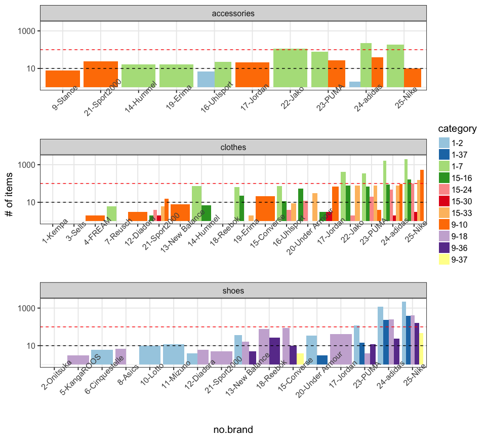
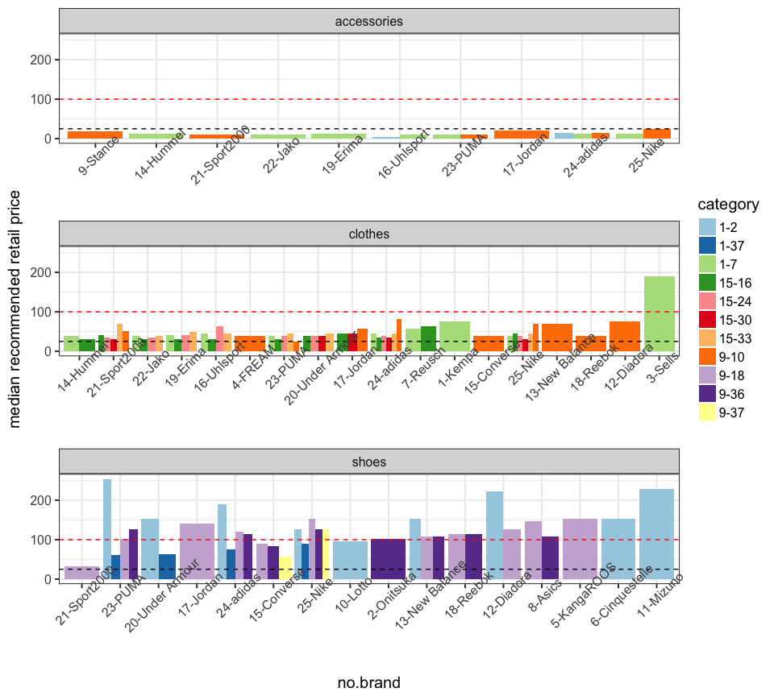

My findings
===========

Read Data
---------

``` r
library(sugrrants)
library(tidyverse)
library(lubridate)
library(forcats)
library(corrplot)
setwd("~/Dropbox/dmc2018")
train <- read.csv("data/raw_data/train.csv", sep = "|")
prices <- read.csv("data/raw_data/prices.csv", sep = "|")
items <- read.csv("data/raw_data/items.csv", sep = "|")
```

### data quality

``` r
## no missing in training data
apply(train, 2, function(x) sum(is.na(x)))
```

    ##  date   pid  size units 
    ##     0     0     0     0

``` r
## some missing in subCategory
apply(items, 2, function(x) sum(is.na(x)))
```

    ##          pid         size        color        brand          rrp 
    ##            0            0            0            0            0 
    ## mainCategory     category  subCategory        stock  releaseDate 
    ##            0            0         1134            0            0

``` r
## all keys appear in every data set
anti_join(train, items, by = c("pid", "size")) %>% dim()
```

    ## [1] 0 4

``` r
anti_join(items, train, by = c("pid", "size")) %>% dim()
```

    ## [1]  0 10

``` r
anti_join(items, prices, by = c("pid", "size")) %>% dim()
```

    ## [1]  0 10

Dates
-----

``` r
## sales data available everyday from 2017-10-01 to 2018-01-31
train$date <- ymd(train$date)
range(train$date)
```

    ## [1] "2017-10-01" "2018-01-31"

``` r
range(train$date) %>% diff
```

    ## Time difference of 122 days

``` r
unique(train$date) %>% length()
```

    ## [1] 123

``` r
## about 85% of the items released before 2017-10-01
items$releaseDate <- ymd(items$releaseDate)
mean(items$releaseDate == ymd("2017-10-01"))
```

    ## [1] 0.849345

### price & date

``` r
## gather date and price by product ID and size
prices %>% gather(date, price, -pid, -size) %>%
  mutate(date = gsub("X", "", date) %>% ymd()) -> prices_long
prices_long %>% glimpse
```

    ## Observations: 1,936,424
    ## Variables: 4
    ## $ pid   <int> 19671, 19671, 19671, 19671, 19671, 19671, 19671, 19671, ...
    ## $ size  <fctr> 39 1/3, 40, 41 1/3, 42, 42 2/3, 43 1/3, 44, 44 2/3, 45 ...
    ## $ date  <date> 2017-10-01, 2017-10-01, 2017-10-01, 2017-10-01, 2017-10...
    ## $ price <dbl> 133.31, 133.31, 133.31, 133.31, 133.31, 133.31, 133.31, ...

``` r
## releaseDate is the same for a product across different sizes, 4770 different pid
items %>% group_by(pid) %>%
  summarise(ndate = unique(releaseDate) %>% length) %>%
  select(ndate) %>% table()
```

    ## .
    ##    1 
    ## 4770

``` r
## * before releasedate, any non-missing prices? Yes 
items %>% left_join(prices_long, by = c("pid", "size")) %>% 
  filter(date < releaseDate, !is.na(price)) -> prices_suspicious
prices_suspicious %>% glimpse
```

    ## Observations: 1,932
    ## Variables: 12
    ## $ pid          <int> 10013, 10013, 10013, 10042, 10050, 10115, 10115, ...
    ## $ size         <fctr> L, M, S, 37,5, M, 43 1/3, 44, 33, XL ( 44/46 ), ...
    ## $ color        <fctr> schwarz, schwarz, schwarz, blau, schwarz, weiss,...
    ## $ brand        <fctr> adidas, adidas, adidas, Nike, PUMA, adidas, adid...
    ## $ rrp          <dbl> 69.78, 69.78, 69.78, 88.83, 50.73, 126.93, 126.93...
    ## $ mainCategory <int> 1, 1, 1, 1, 1, 9, 9, 1, 1, 9, 9, 9, 9, 1, 1, 1, 1...
    ## $ category     <int> 7, 7, 7, 37, 7, 18, 18, 37, 7, 10, 18, 18, 18, 2,...
    ## $ subCategory  <int> 16, 16, 16, 6, 16, 32, 32, 39, 14, 22, 32, 32, 32...
    ## $ stock        <int> 1, 1, 1, 2, 1, 2, 1, 1, 1, 1, 1, 2, 1, 2, 3, 1, 2...
    ## $ releaseDate  <date> 2017-10-27, 2017-10-27, 2017-10-27, 2017-11-10, ...
    ## $ date         <date> 2017-10-26, 2017-10-26, 2017-10-26, 2017-11-09, ...
    ## $ price        <dbl> 41.21, 41.21, 41.21, 69.95, 27.97, 99.95, 99.95, ...

``` r
## all products released after 2017-10-01 have price info before release date 
anti_join(items %>% filter(releaseDate > ymd("2017-10-01")),
          prices_suspicious, by = "pid") %>% dim
```

    ## [1]  0 10

``` r
## in each row, date is one-day earlier than releaseDate
prices_suspicious %>% mutate(diff_date = date-releaseDate) %>% select(diff_date) %>% table()
```

    ## .
    ##   -1 
    ## 1932

``` r
## * after releasedate, any missing prices? No 
items %>% left_join(prices_long, by = c("pid", "size")) %>% 
  filter(date >= releaseDate) %>% select(price) %>% summary()
```

    ##      price       
    ##  Min.   :  2.47  
    ##  1st Qu.: 23.76  
    ##  Median : 48.85  
    ##  Mean   : 78.41  
    ##  3rd Qu.:102.81  
    ##  Max.   :419.03

### calendar plots

``` r
## remarkably more sales on Black Friday 2017-11-24
train.sales <- train %>% group_by(date) %>% summarise(n = sum(units)) %>% ungroup 
train.sales %>%
  frame_calendar(x = 1, y = 1, date = date) %>%
  ggplot(aes(x = .x, y = .y)) + 
  ggtitle("log-scale daily sold units") + 
  theme(legend.position = "bottom") +
  geom_tile(aes(x = .x+(1/13)/2, y = .y+(1/9)/2, fill = log(n)), colour = "grey50") +
  scale_fill_distiller(name = "", palette = "RdYlBu") -> p2.sale
prettify(p2.sale, label = c("label", "text", "text2"))
```


``` r
## use raw releasedate
## more new products released around Black Friday
items.release <- items %>% group_by(releaseDate) %>% tally() %>% ungroup
## consider release dates other than 2017-10-01
items.release %>% filter(releaseDate != ymd("2017-10-01")) %>%
  frame_calendar(x = 1, y = 1, date = releaseDate, calendar = "monthly") %>%
  ggplot(aes(x = .x, y = .y)) + 
  ggtitle("log-scale daily released products") +
  theme(legend.position = "bottom") +
  geom_tile(aes(x = .x+(1/13)/2, y = .y+(1/9)/2, fill = log(n)), colour = "grey50") +
  scale_fill_distiller(name = "", palette = "RdYlBu") -> p2.release
prettify(p2.release, label = c("label", "text", "text2"))
```


Brands
------

``` r
## color, brand, rrp, category(main/sub), releaseDate same for product of different sizes
items %>% select(-size, -stock) %>% unique %>% glimpse
```

    ## Observations: 4,770
    ## Variables: 8
    ## $ pid          <int> 10000, 10001, 10003, 10006, 10008, 10013, 10015, ...
    ## $ color        <fctr> gruen, schwarz, weiss, blau, blau, schwarz, blau...
    ## $ brand        <fctr> Nike, Jako, Jako, Under Armour, PUMA, adidas, PU...
    ## $ rrp          <dbl> 25.33, 38.03, 12.63, 57.08, 25.33, 69.78, 25.33, ...
    ## $ mainCategory <int> 1, 1, 1, 15, 1, 1, 1, 15, 9, 1, 9, 9, 1, 9, 1, 1,...
    ## $ category     <int> 7, 7, 7, 24, 7, 7, 7, 33, 10, 7, 10, 18, 7, 18, 3...
    ## $ subCategory  <int> 25, 16, 13, NA, 8, 16, 8, NA, 14, 31, 35, 32, 22,...
    ## $ releaseDate  <date> 2017-10-01, 2017-10-01, 2017-10-01, 2017-10-01, ...

``` r
items$pid %>% unique() %>% glimpse
```

    ##  int [1:4770] 10000 10001 10003 10006 10008 10013 10015 10017 10020 10025 ...

``` r
## 25 brands
items %>% group_by(brand) %>% 
  summarise(npid = length(unique(pid)), 
            nitem = n(),
            nstock = sum(stock),
            medrrp = median(rrp[!duplicated(pid)]),
            nmaincat = length(unique(mainCategory)),
            ncat = length(unique(category)),
            nsubcat = length(unique(subCategory)),
            nnewrelease = length(unique(pid[releaseDate>ymd("2017-10-01")]))
  ) %>% 
  arrange(desc(npid)) -> brands
brands <- brands %>% mutate(brand = fct_reorder(brand, nstock, mean)) %>%
  mutate(order = as.numeric(brand)) %>% mutate(brand = paste(order, brand, sep = "-"))
str(brands)
```

    ## Classes 'tbl_df', 'tbl' and 'data.frame':    25 obs. of  10 variables:
    ##  $ brand      : chr  "25-Nike" "24-adidas" "23-PUMA" "22-Jako" ...
    ##  $ npid       : int  2126 1277 389 377 91 81 76 75 69 49 ...
    ##  $ nitem      : int  6389 3969 772 673 126 107 136 135 95 123 ...
    ##  $ nstock     : int  25024 15272 1735 1396 188 242 199 275 136 160 ...
    ##  $ medrrp     : num  69.8 57.1 44.4 31.7 35.5 ...
    ##  $ nmaincat   : int  3 3 3 2 2 2 2 2 2 1 ...
    ##  $ ncat       : int  10 10 9 4 5 4 4 6 2 4 ...
    ##  $ nsubcat    : int  29 31 21 16 16 14 10 5 13 6 ...
    ##  $ nnewrelease: int  256 349 39 2 0 1 14 0 2 2 ...
    ##  $ order      : num  25 24 23 22 16 19 17 20 14 15 ...

``` r
## standardize variables before computing correlation
brandst <- data.frame(t(scale(brands[,-1])))
colnames(brandst) <- unlist(brands$brand)
str(brandst)
```

    ## 'data.frame':    9 obs. of  25 variables:
    ##  $ 25-Nike        : num  4.016 4.025 4.065 -0.277 1.943 ...
    ##  $ 24-adidas      : num  2.254 2.367 2.357 -0.509 1.943 ...
    ##  $ 23-PUMA        : num  0.4114 0.1774 -0.0135 -0.7419 1.9429 ...
    ##  $ 22-Jako        : num  0.3865 0.1096 -0.0729 -0.9744 0.5143 ...
    ##  $ 16-Uhlsport    : num  -0.207 -0.265 -0.284 -0.905 0.514 ...
    ##  $ 19-Erima       : num  -0.228 -0.278 -0.275 -0.905 0.514 ...
    ##  $ 17-Jordan      : num  -0.238 -0.258 -0.282 -0.567 0.514 ...
    ##  $ 20-Under Armour: num  -0.24 -0.259 -0.269 -0.626 0.514 ...
    ##  $ 14-Hummel      : num  -0.253 -0.286 -0.294 -0.974 0.514 ...
    ##  $ 15-Converse    : num  -0.2943 -0.2671 -0.2893 -0.0442 -0.9143 ...
    ##  $ 13-New Balance : num  -0.298 -0.307 -0.305 0.421 0.514 ...
    ##  $ 18-Reebok      : num  -0.33 -0.28 -0.282 0.537 -0.914 ...
    ##  $ 21-Sport2000   : num  -0.342 -0.312 -0.26 -0.905 0.514 ...
    ##  $ 12-Diadora     : num  -0.373 -0.342 -0.315 0.77 0.514 ...
    ##  $ 8-Asics        : num  -0.381 -0.346 -0.316 1.119 -0.914 ...
    ##  $ 11-Mizuno      : num  -0.381 -0.343 -0.315 2.63 -0.914 ...
    ##  $ 9-Stance       : num  -0.381 -0.346 -0.316 -1.184 -0.914 ...
    ##  $ 10-Lotto       : num  -0.384 -0.345 -0.315 0.188 -0.914 ...
    ##  $ 7-Reusch       : num  -0.384 -0.347 -0.316 -0.509 0.514 ...
    ##  $ 6-Cinquestelle : num  -0.388 -0.347 -0.316 1.002 -0.914 ...
    ##  $ 4-FREAM        : num  -0.392 -0.35 -0.317 -0.858 -0.914 ...
    ##  $ 5-KangaROOS    : num  -0.392 -0.349 -0.317 1.235 -0.914 ...
    ##  $ 1-Kempa        : num  -0.394 -0.351 -0.317 -0.16 -0.914 ...
    ##  $ 2-Onitsuka     : num  -0.394 -0.351 -0.317 0.305 -0.914 ...
    ##  $ 3-Sells        : num  -0.394 -0.351 -0.317 1.933 -0.914 ...

``` r
brands.cor <- cor(brandst)
corrplot(brands.cor, type = "upper", order = "hclust")
```



``` r
## rename brand by adding rank of # of stock
items %>% mutate(brand = fct_reorder(brand, stock, sum)) %>%
  mutate(rank = as.numeric(brand)) %>%
  mutate(brand = paste(rank, brand, sep = "-")) -> items.brand
## stock by brand, checking new names
## first 12 brands with total stock less than 15
ggplot(data = items.brand %>% mutate(brand = fct_reorder(brand, stock, sum))) +
  ggtitle("stock on Feb 1st by brand") +
  geom_boxplot(aes(x=brand, y=stock, color = brand)) + 
  scale_y_log10() + theme_bw(base_size = 15) + guides(color = FALSE) +
  theme(axis.text.x = element_text(angle = 45)) 
```


``` r
## rrp by brand 
## some brands are low-stock due to high price
ggplot(data = items.brand %>% mutate(brand = fct_reorder(brand, rrp, median))) +
  ggtitle("recommended retail price by brand") +
  geom_boxplot(aes(x=brand, y=rrp, color = brand)) + 
  theme_bw(base_size = 15) + guides(color = FALSE) +
  theme(axis.text.x = element_text(angle = 45)) 
```



``` r
## sales by brand during Oct-Jan
## stock strongly positively correlated with sales
ggplot(data = train %>% left_join(items.brand, by = c("pid", "size")) %>%
         mutate(brand = fct_reorder(brand, units, sum))) + 
  ggtitle("sales during Oct-Jan by brand") +
  geom_boxplot(aes(x = brand, y = units, color = brand), alpha = 0.6) +
  scale_y_log10() + theme_bw(base_size = 15) + guides(color = FALSE) +
  theme(axis.text.x = element_text(angle = 45))
```


Prices Revisit
--------------

``` r
## same product has difference daily prices for different sizes
prices_long %>% filter(pid == 16427, date == ymd("2017-10-01"))
```

    ##      pid   size       date  price
    ## 1  16427 39 1/3 2017-10-01 100.87
    ## 2  16427 40 2/3 2017-10-01  95.73
    ## 3  16427 41 1/3 2017-10-01 102.08
    ## 4  16427     42 2017-10-01  95.11
    ## 5  16427 42 2/3 2017-10-01  94.15
    ## 6  16427 43 1/3 2017-10-01  95.18
    ## 7  16427     44 2017-10-01  95.78
    ## 8  16427 44 2/3 2017-10-01  95.84
    ## 9  16427 45 1/3 2017-10-01  95.14
    ## 10 16427     46 2017-10-01  95.63
    ## 11 16427 47 1/3 2017-10-01  95.61

Data Join
---------

``` r
## any sale before releaseDate? No
left_join(prices_long, train, by = c("pid", "size", "date")) %>% 
  left_join(items, by = c("pid", "size")) %>%
  filter(date<releaseDate, !is.na(units)) %>% dim
```

    ## [1]  0 13

``` r
## joining three tables: items, prices, train
## sale unit is zero if not appearing in the train data for a particular day
## discount says how many percent off the rrp
## diffprice says price differences from previous day
## reldiffprice says how many percent down/up from previous day
left_join(prices_long, train, by = c("pid", "size", "date")) %>% 
  left_join(items, by = c("pid", "size")) %>%
  filter(date>=releaseDate) %>% 
  mutate(units = replace(units, is.na(units) & date < ymd("2018-02-01"), 0),
         discount = (rrp-price)/rrp*100) %>% 
  group_by(pid, size) %>% 
  mutate(diffprice = price - lag(price)) %>%
  mutate(reldiffprice = diffprice/lag(price)*100) -> alldata
## all prices lower than rrp? Yes
summary(alldata$discount)
```

    ##    Min. 1st Qu.  Median    Mean 3rd Qu.    Max. 
    ##    0.00   20.00   25.01   23.63   33.07   80.04

``` r
## any rising prices? Yes
summary(alldata$diffprice)
```

    ##    Min. 1st Qu.  Median    Mean 3rd Qu.    Max.    NA's 
    ## -89.980   0.000   0.000  -0.013   0.000  86.630   12824

``` r
summary(alldata$reldiffprice)
```

    ##    Min. 1st Qu.  Median    Mean 3rd Qu.    Max.    NA's 
    ## -49.987   0.000   0.000  -0.005   0.000  90.201   12824

### rising prices

``` r
## only new released items may have a rising price 
alldata %>% group_by(pid, size) %>% 
  summarise(yn.priceincr = any(reldiffprice > 0, na.rm = T),
            yn.newrelease = all(releaseDate > ymd("2017-10-01"))) %>%
  ungroup -> check
check %>% select(yn.priceincr, yn.newrelease) %>% table
```

    ##             yn.newrelease
    ## yn.priceincr FALSE  TRUE
    ##        FALSE 10892   222
    ##        TRUE      0  1710

### best seller

``` r
## bestseller among (pid, size)
alldata %>% group_by(pid, size) %>% 
  summarise(nsale = sum(units, na.rm = T)) %>% 
  arrange(desc(nsale)) %>% head(1)
```

    ## # A tibble: 1 x 3
    ## # Groups:   pid [1]
    ##     pid   size nsale
    ##   <int> <fctr> <dbl>
    ## 1 12985      L  2979

``` r
## being sold everyday, prices never change, 40% off
alldata %>% filter(pid == 12985, size == "L") %>% arrange(desc(units)) %>% head(10)
```

    ## # A tibble: 10 x 16
    ## # Groups:   pid, size [1]
    ##      pid   size       date price units   color  brand   rrp mainCategory
    ##    <int> <fctr>     <date> <dbl> <dbl>  <fctr> <fctr> <dbl>        <int>
    ##  1 12985      L 2017-11-24 28.91   129 schwarz adidas 48.19            1
    ##  2 12985      L 2017-11-26 28.91    94 schwarz adidas 48.19            1
    ##  3 12985      L 2018-01-31 28.91    82 schwarz adidas 48.19            1
    ##  4 12985      L 2017-10-03 28.91    71 schwarz adidas 48.19            1
    ##  5 12985      L 2018-01-23 28.91    60 schwarz adidas 48.19            1
    ##  6 12985      L 2018-01-22 28.91    58 schwarz adidas 48.19            1
    ##  7 12985      L 2017-12-03 28.91    51 schwarz adidas 48.19            1
    ##  8 12985      L 2018-01-24 28.91    49 schwarz adidas 48.19            1
    ##  9 12985      L 2018-01-30 28.91    47 schwarz adidas 48.19            1
    ## 10 12985      L 2018-01-11 28.91    45 schwarz adidas 48.19            1
    ## # ... with 7 more variables: category <int>, subCategory <int>,
    ## #   stock <int>, releaseDate <date>, discount <dbl>, diffprice <dbl>,
    ## #   reldiffprice <dbl>

``` r
## bestseller among which there is an increase in price
alldata %>% group_by(pid, size) %>% 
  filter(any(reldiffprice > 0)) %>% 
  summarise(nsale = sum(units, na.rm = T)) %>% 
  arrange(desc(nsale)) %>% head(1)
```

    ## # A tibble: 1 x 3
    ## # Groups:   pid [1]
    ##     pid   size nsale
    ##   <int> <fctr> <dbl>
    ## 1 20828      L   474

``` r
alldata %>% filter(pid == 20828, size == "L") %>% arrange(desc(abs(reldiffprice))) %>% head(10)
```

    ## # A tibble: 10 x 16
    ## # Groups:   pid, size [1]
    ##      pid   size       date price units   color  brand   rrp mainCategory
    ##    <int> <fctr>     <date> <dbl> <dbl>  <fctr> <fctr> <dbl>        <int>
    ##  1 20828      L 2017-12-11 25.97    19 schwarz adidas 50.73           15
    ##  2 20828      L 2017-12-15 25.97     4 schwarz adidas 50.73           15
    ##  3 20828      L 2018-01-24 25.97    21 schwarz adidas 50.73           15
    ##  4 20828      L 2017-12-04 21.97     0 schwarz adidas 50.73           15
    ##  5 20828      L 2017-12-16 22.95     1 schwarz adidas 50.73           15
    ##  6 20828      L 2018-01-17 23.97    20 schwarz adidas 50.73           15
    ##  7 20828      L 2017-12-08 23.97    12 schwarz adidas 50.73           15
    ##  8 20828      L 2017-12-24 23.97     2 schwarz adidas 50.73           15
    ##  9 20828      L 2018-01-08 23.97     9 schwarz adidas 50.73           15
    ## 10 20828      L 2018-02-11 23.97    NA schwarz adidas 50.73           15
    ## # ... with 7 more variables: category <int>, subCategory <int>,
    ## #   stock <int>, releaseDate <date>, discount <dbl>, diffprice <dbl>,
    ## #   reldiffprice <dbl>

``` r
## bestseller among which there is no discount all the time
alldata %>% group_by(pid, size) %>% filter(all(discount == 0)) %>% 
  summarise(nsale = sum(units, na.rm = T)) %>% 
  arrange(desc(nsale)) %>% head(1)
```

    ## # A tibble: 1 x 3
    ## # Groups:   pid [1]
    ##     pid        size nsale
    ##   <int>      <fctr> <dbl>
    ## 1 22144 L ( 42-46 )  1044

``` r
alldata %>% filter(pid == 22144, size == "L ( 42-46 )") %>% arrange(desc(units)) %>% head(10)
```

    ## # A tibble: 10 x 16
    ## # Groups:   pid, size [1]
    ##      pid        size       date price units   color     brand   rrp
    ##    <int>      <fctr>     <date> <dbl> <dbl>  <fctr>    <fctr> <dbl>
    ##  1 22144 L ( 42-46 ) 2017-10-03 10.09   143 schwarz Sport2000 10.09
    ##  2 22144 L ( 42-46 ) 2017-10-31 10.09    39 schwarz Sport2000 10.09
    ##  3 22144 L ( 42-46 ) 2017-11-24 10.09    37 schwarz Sport2000 10.09
    ##  4 22144 L ( 42-46 ) 2017-12-03 10.09    33 schwarz Sport2000 10.09
    ##  5 22144 L ( 42-46 ) 2017-12-05 10.09    30 schwarz Sport2000 10.09
    ##  6 22144 L ( 42-46 ) 2017-11-04 10.09    29 schwarz Sport2000 10.09
    ##  7 22144 L ( 42-46 ) 2017-12-04 10.09    28 schwarz Sport2000 10.09
    ##  8 22144 L ( 42-46 ) 2017-10-04 10.09    27 schwarz Sport2000 10.09
    ##  9 22144 L ( 42-46 ) 2017-11-01 10.09    24 schwarz Sport2000 10.09
    ## 10 22144 L ( 42-46 ) 2017-10-30 10.09    23 schwarz Sport2000 10.09
    ## # ... with 8 more variables: mainCategory <int>, category <int>,
    ## #   subCategory <int>, stock <int>, releaseDate <date>, discount <dbl>,
    ## #   diffprice <dbl>, reldiffprice <dbl>

``` r
itemsofinterest <- data.frame(
  label = c("bestseller", "bestseller - rising price", "bestseller - no discount"),
  pid = c(12985, 20828, 22144), size = c("L", "L", "L ( 42-46 )"))
alldata %>% inner_join(itemsofinterest, by = c("pid", "size")) -> plotdata
## time series plot
## holiday reference: www.timeanddate.com/holidays/germany/2017
plotdata %>% group_by(pid, size) %>% mutate(avg.discount = mean(discount)) %>% ungroup %>%
  ggplot(aes(x = date)) + 
  geom_line(aes(y = units, color = "daily sale (unit)")) +
  geom_line(aes(y = reldiffprice, color = "daily price change (%)")) +
  geom_label(aes(x = max(date), y = max(units, na.rm = T),
                 label = sprintf("brand: %s, rrp: %.2f, %.0f%% off", brand, rrp, avg.discount)),
             hjust = 1, vjust = 1, size = 5, fontface = "bold") +
  geom_vline(aes(color = "NH - German Unity", xintercept = ymd("2017-10-03")), show.legend = T) +
  geom_vline(aes(color = "NH - Reformation Day", xintercept = ymd("2017-10-31")), show.legend = T) +
  geom_vline(aes(color = "NH - Black Friday", xintercept = ymd("2017-11-24")), show.legend = T) +
  scale_x_date(limits = c(ymd("2017-10-01"), ymd("2018-02-28"))) + 
  labs(x = "date", y = "", color = "") +
  theme_bw(base_size = 15) + theme(legend.position = "bottom") +
  facet_wrap(~label, nrow = 3)
```


