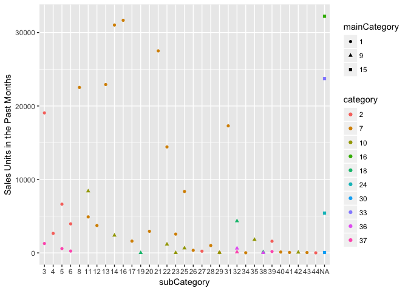

``` r
##
items <- read.csv("/Users/yudi/Downloads/DMC-2018/raw_data/items.csv", sep = "|")
View(items)
prices <- read.csv("/Users/yudi/Downloads/DMC-2018/raw_data/prices.csv", sep = "|")
train <- read.csv("/Users/yudi/Downloads/DMC-2018/raw_data/train.csv", sep = "|")
```

1. Data.Overview
----------------

``` r
#Missing values in subCat
apply(items, 2, function(x) sum(is.na(x)))
```

    ##          pid         size        color        brand          rrp 
    ##            0            0            0            0            0 
    ## mainCategory     category  subCategory        stock  releaseDate 
    ##            0            0         1134            0            0

``` r
#Cat.Overview
table(items$category) %>% pander()
```

<table style="width:85%;">
<colgroup>
<col width="9%" />
<col width="9%" />
<col width="8%" />
<col width="8%" />
<col width="8%" />
<col width="8%" />
<col width="6%" />
<col width="8%" />
<col width="8%" />
<col width="8%" />
</colgroup>
<thead>
<tr class="header">
<th align="center">2</th>
<th align="center">7</th>
<th align="center">10</th>
<th align="center">16</th>
<th align="center">18</th>
<th align="center">24</th>
<th align="center">30</th>
<th align="center">33</th>
<th align="center">36</th>
<th align="center">37</th>
</tr>
</thead>
<tbody>
<tr class="odd">
<td align="center">3705</td>
<td align="center">5276</td>
<td align="center">873</td>
<td align="center">491</td>
<td align="center">918</td>
<td align="center">193</td>
<td align="center">11</td>
<td align="center">439</td>
<td align="center">244</td>
<td align="center">674</td>
</tr>
</tbody>
</table>

``` r
table(items$mainCategory) %>% pander()
```

<table style="width:29%;">
<colgroup>
<col width="9%" />
<col width="9%" />
<col width="9%" />
</colgroup>
<thead>
<tr class="header">
<th align="center">1</th>
<th align="center">9</th>
<th align="center">15</th>
</tr>
</thead>
<tbody>
<tr class="odd">
<td align="center">9605</td>
<td align="center">2085</td>
<td align="center">1134</td>
</tr>
</tbody>
</table>

``` r
table(items$subCategory) %>% pander()
```

<table style="width:100%;">
<caption>Table continues below</caption>
<colgroup>
<col width="9%" />
<col width="8%" />
<col width="8%" />
<col width="8%" />
<col width="8%" />
<col width="8%" />
<col width="6%" />
<col width="8%" />
<col width="8%" />
<col width="8%" />
<col width="6%" />
<col width="6%" />
<col width="6%" />
</colgroup>
<thead>
<tr class="header">
<th align="center">3</th>
<th align="center">4</th>
<th align="center">5</th>
<th align="center">6</th>
<th align="center">8</th>
<th align="center">11</th>
<th align="center">12</th>
<th align="center">13</th>
<th align="center">14</th>
<th align="center">16</th>
<th align="center">17</th>
<th align="center">19</th>
<th align="center">20</th>
</tr>
</thead>
<tbody>
<tr class="odd">
<td align="center">2372</td>
<td align="center">326</td>
<td align="center">559</td>
<td align="center">623</td>
<td align="center">725</td>
<td align="center">218</td>
<td align="center">88</td>
<td align="center">460</td>
<td align="center">734</td>
<td align="center">665</td>
<td align="center">96</td>
<td align="center">2</td>
<td align="center">149</td>
</tr>
</tbody>
</table>

<table style="width:100%;">
<caption>Table continues below</caption>
<colgroup>
<col width="8%" />
<col width="7%" />
<col width="7%" />
<col width="7%" />
<col width="6%" />
<col width="6%" />
<col width="7%" />
<col width="6%" />
<col width="7%" />
<col width="8%" />
<col width="6%" />
<col width="7%" />
<col width="6%" />
<col width="6%" />
</colgroup>
<thead>
<tr class="header">
<th align="center">21</th>
<th align="center">22</th>
<th align="center">23</th>
<th align="center">25</th>
<th align="center">26</th>
<th align="center">27</th>
<th align="center">28</th>
<th align="center">29</th>
<th align="center">31</th>
<th align="center">32</th>
<th align="center">34</th>
<th align="center">35</th>
<th align="center">38</th>
<th align="center">39</th>
</tr>
</thead>
<tbody>
<tr class="odd">
<td align="center">1082</td>
<td align="center">514</td>
<td align="center">178</td>
<td align="center">510</td>
<td align="center">38</td>
<td align="center">9</td>
<td align="center">124</td>
<td align="center">25</td>
<td align="center">252</td>
<td align="center">1164</td>
<td align="center">4</td>
<td align="center">210</td>
<td align="center">46</td>
<td align="center">434</td>
</tr>
</tbody>
</table>

<table style="width:35%;">
<colgroup>
<col width="6%" />
<col width="6%" />
<col width="6%" />
<col width="6%" />
<col width="6%" />
</colgroup>
<thead>
<tr class="header">
<th align="center">40</th>
<th align="center">41</th>
<th align="center">42</th>
<th align="center">43</th>
<th align="center">44</th>
</tr>
</thead>
<tbody>
<tr class="odd">
<td align="center">35</td>
<td align="center">7</td>
<td align="center">21</td>
<td align="center">14</td>
<td align="center">6</td>
</tr>
</tbody>
</table>

``` r
#Only mainCat 1 and 9 have a same cat 37
table(items$category, items$mainCategory) %>% pander()
```

<table style="width:39%;">
<colgroup>
<col width="12%" />
<col width="9%" />
<col width="8%" />
<col width="8%" />
</colgroup>
<thead>
<tr class="header">
<th align="center"> </th>
<th align="center">1</th>
<th align="center">9</th>
<th align="center">15</th>
</tr>
</thead>
<tbody>
<tr class="odd">
<td align="center"><strong>2</strong></td>
<td align="center">3705</td>
<td align="center">0</td>
<td align="center">0</td>
</tr>
<tr class="even">
<td align="center"><strong>7</strong></td>
<td align="center">5276</td>
<td align="center">0</td>
<td align="center">0</td>
</tr>
<tr class="odd">
<td align="center"><strong>10</strong></td>
<td align="center">0</td>
<td align="center">873</td>
<td align="center">0</td>
</tr>
<tr class="even">
<td align="center"><strong>16</strong></td>
<td align="center">0</td>
<td align="center">0</td>
<td align="center">491</td>
</tr>
<tr class="odd">
<td align="center"><strong>18</strong></td>
<td align="center">0</td>
<td align="center">918</td>
<td align="center">0</td>
</tr>
<tr class="even">
<td align="center"><strong>24</strong></td>
<td align="center">0</td>
<td align="center">0</td>
<td align="center">193</td>
</tr>
<tr class="odd">
<td align="center"><strong>30</strong></td>
<td align="center">0</td>
<td align="center">0</td>
<td align="center">11</td>
</tr>
<tr class="even">
<td align="center"><strong>33</strong></td>
<td align="center">0</td>
<td align="center">0</td>
<td align="center">439</td>
</tr>
<tr class="odd">
<td align="center"><strong>36</strong></td>
<td align="center">0</td>
<td align="center">244</td>
<td align="center">0</td>
</tr>
<tr class="even">
<td align="center"><strong>37</strong></td>
<td align="center">624</td>
<td align="center">50</td>
<td align="center">0</td>
</tr>
</tbody>
</table>

``` r
#mainCat 15 doesn't have subcat
table(items$subCategory, items$mainCategory) %>% pander()
```

<table style="width:38%;">
<colgroup>
<col width="12%" />
<col width="9%" />
<col width="9%" />
<col width="5%" />
</colgroup>
<thead>
<tr class="header">
<th align="center"> </th>
<th align="center">1</th>
<th align="center">9</th>
<th align="center">15</th>
</tr>
</thead>
<tbody>
<tr class="odd">
<td align="center"><strong>3</strong></td>
<td align="center">2372</td>
<td align="center">0</td>
<td align="center">0</td>
</tr>
<tr class="even">
<td align="center"><strong>4</strong></td>
<td align="center">326</td>
<td align="center">0</td>
<td align="center">0</td>
</tr>
<tr class="odd">
<td align="center"><strong>5</strong></td>
<td align="center">559</td>
<td align="center">0</td>
<td align="center">0</td>
</tr>
<tr class="even">
<td align="center"><strong>6</strong></td>
<td align="center">623</td>
<td align="center">0</td>
<td align="center">0</td>
</tr>
<tr class="odd">
<td align="center"><strong>8</strong></td>
<td align="center">725</td>
<td align="center">0</td>
<td align="center">0</td>
</tr>
<tr class="even">
<td align="center"><strong>11</strong></td>
<td align="center">89</td>
<td align="center">129</td>
<td align="center">0</td>
</tr>
<tr class="odd">
<td align="center"><strong>12</strong></td>
<td align="center">88</td>
<td align="center">0</td>
<td align="center">0</td>
</tr>
<tr class="even">
<td align="center"><strong>13</strong></td>
<td align="center">460</td>
<td align="center">0</td>
<td align="center">0</td>
</tr>
<tr class="odd">
<td align="center"><strong>14</strong></td>
<td align="center">533</td>
<td align="center">201</td>
<td align="center">0</td>
</tr>
<tr class="even">
<td align="center"><strong>16</strong></td>
<td align="center">665</td>
<td align="center">0</td>
<td align="center">0</td>
</tr>
<tr class="odd">
<td align="center"><strong>17</strong></td>
<td align="center">96</td>
<td align="center">0</td>
<td align="center">0</td>
</tr>
<tr class="even">
<td align="center"><strong>19</strong></td>
<td align="center">0</td>
<td align="center">2</td>
<td align="center">0</td>
</tr>
<tr class="odd">
<td align="center"><strong>20</strong></td>
<td align="center">149</td>
<td align="center">0</td>
<td align="center">0</td>
</tr>
<tr class="even">
<td align="center"><strong>21</strong></td>
<td align="center">1082</td>
<td align="center">0</td>
<td align="center">0</td>
</tr>
<tr class="odd">
<td align="center"><strong>22</strong></td>
<td align="center">385</td>
<td align="center">129</td>
<td align="center">0</td>
</tr>
<tr class="even">
<td align="center"><strong>23</strong></td>
<td align="center">173</td>
<td align="center">5</td>
<td align="center">0</td>
</tr>
<tr class="odd">
<td align="center"><strong>25</strong></td>
<td align="center">347</td>
<td align="center">163</td>
<td align="center">0</td>
</tr>
<tr class="even">
<td align="center"><strong>26</strong></td>
<td align="center">38</td>
<td align="center">0</td>
<td align="center">0</td>
</tr>
<tr class="odd">
<td align="center"><strong>27</strong></td>
<td align="center">9</td>
<td align="center">0</td>
<td align="center">0</td>
</tr>
<tr class="even">
<td align="center"><strong>28</strong></td>
<td align="center">124</td>
<td align="center">0</td>
<td align="center">0</td>
</tr>
<tr class="odd">
<td align="center"><strong>29</strong></td>
<td align="center">10</td>
<td align="center">15</td>
<td align="center">0</td>
</tr>
<tr class="even">
<td align="center"><strong>31</strong></td>
<td align="center">252</td>
<td align="center">0</td>
<td align="center">0</td>
</tr>
<tr class="odd">
<td align="center"><strong>32</strong></td>
<td align="center">0</td>
<td align="center">1164</td>
<td align="center">0</td>
</tr>
<tr class="even">
<td align="center"><strong>34</strong></td>
<td align="center">4</td>
<td align="center">0</td>
<td align="center">0</td>
</tr>
<tr class="odd">
<td align="center"><strong>35</strong></td>
<td align="center">0</td>
<td align="center">210</td>
<td align="center">0</td>
</tr>
<tr class="even">
<td align="center"><strong>38</strong></td>
<td align="center">0</td>
<td align="center">46</td>
<td align="center">0</td>
</tr>
<tr class="odd">
<td align="center"><strong>39</strong></td>
<td align="center">434</td>
<td align="center">0</td>
<td align="center">0</td>
</tr>
<tr class="even">
<td align="center"><strong>40</strong></td>
<td align="center">35</td>
<td align="center">0</td>
<td align="center">0</td>
</tr>
<tr class="odd">
<td align="center"><strong>41</strong></td>
<td align="center">7</td>
<td align="center">0</td>
<td align="center">0</td>
</tr>
<tr class="even">
<td align="center"><strong>42</strong></td>
<td align="center">0</td>
<td align="center">21</td>
<td align="center">0</td>
</tr>
<tr class="odd">
<td align="center"><strong>43</strong></td>
<td align="center">14</td>
<td align="center">0</td>
<td align="center">0</td>
</tr>
<tr class="even">
<td align="center"><strong>44</strong></td>
<td align="center">6</td>
<td align="center">0</td>
<td align="center">0</td>
</tr>
</tbody>
</table>

``` r
train %>% group_by(pid, size) %>% summarise(tot = sum(units)) -> totalsale
inner_join(items, totalsale) -> dat.for.ana

#Sales units by maincat, subcat and categories
dat.for.ana %>% group_by(category, subCategory, mainCategory) %>% summarise(tot.sale=sum(tot)) %>% ggplot(aes(x = as.factor(subCategory),y = tot.sale,col = as.factor(category), shape = as.factor(mainCategory))) + geom_point() + labs(y='Sales Units in the Past Months', x="subCategory") + scale_colour_discrete(name  ="category") + scale_shape_discrete(name  ="mainCategory") 
```


